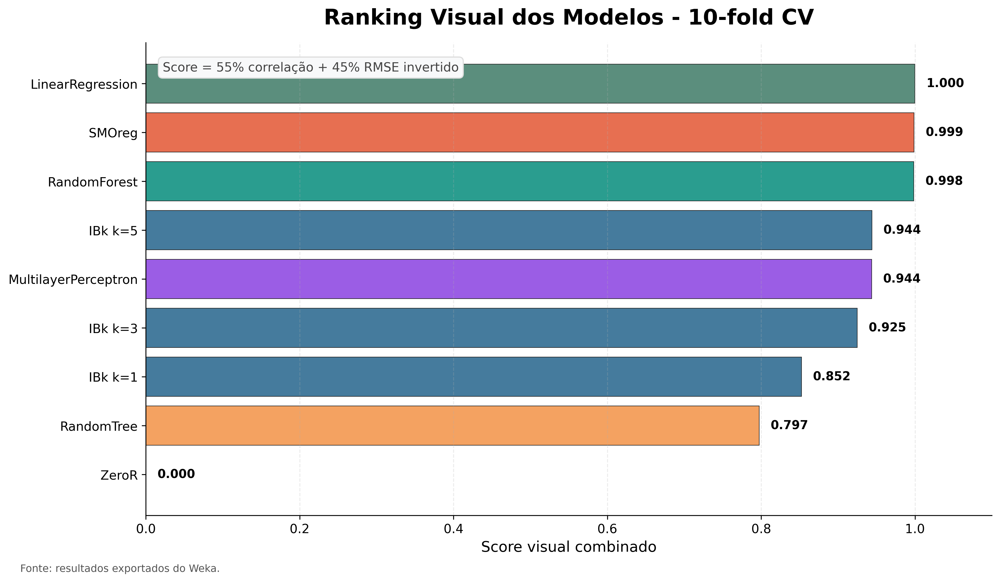
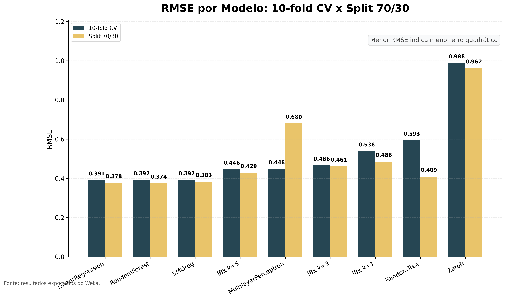
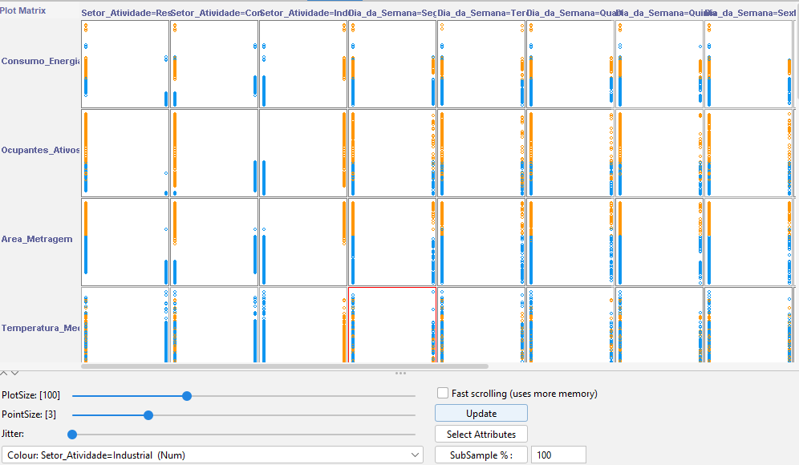
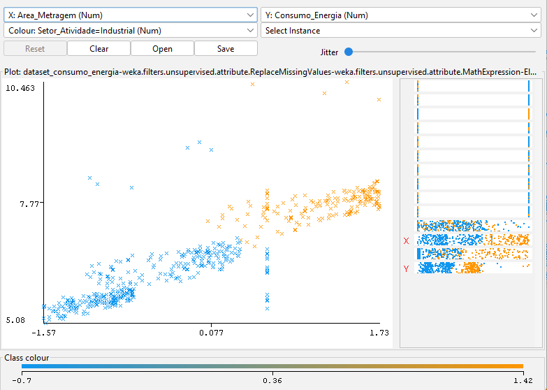
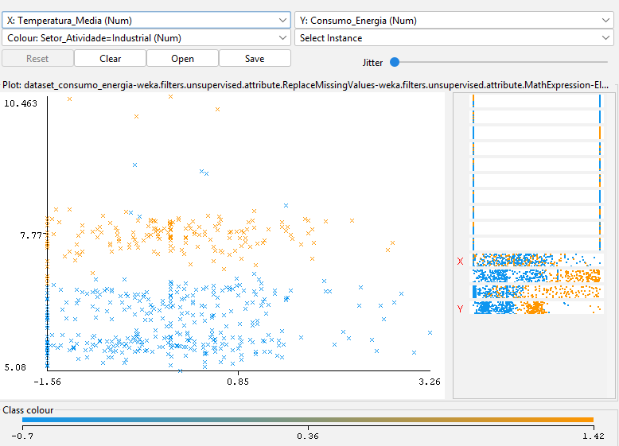
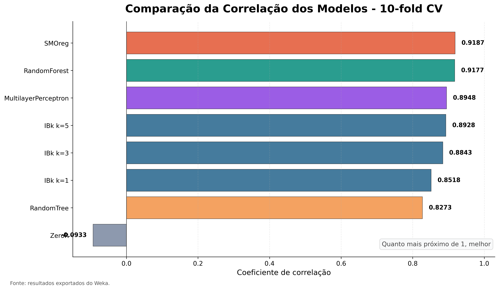
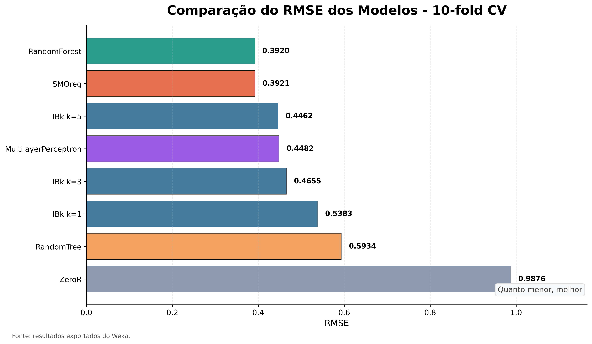
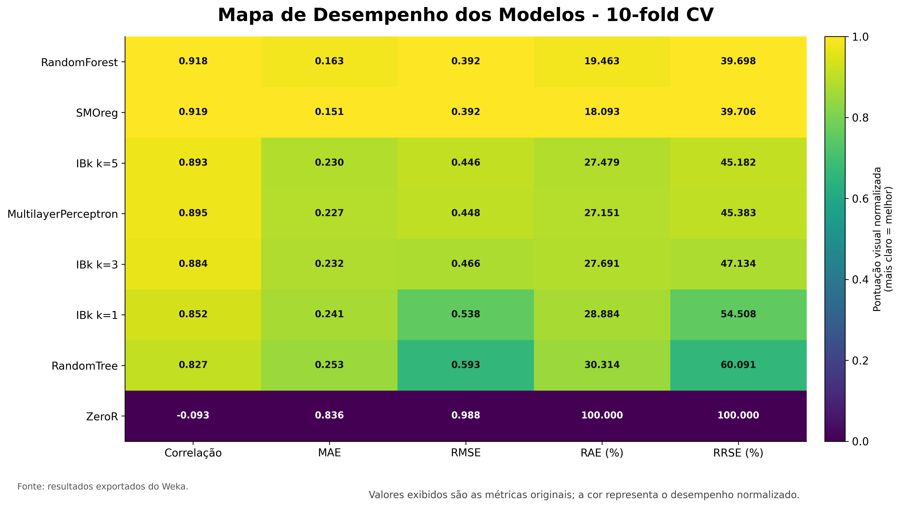

# Previsão de Consumo de Energia Elétrica Multissetorial

Projeto prático de Inteligência Artificial voltado à previsão de consumo de energia elétrica em ambientes **residenciais**, **comerciais** e **industriais**, utilizando **Machine Learning**, **Weka** e uma tarefa de **regressão supervisionada**.

O trabalho cobre o ciclo completo de mineração de dados: fundamentação teórica, geração de dataset sintético, análise exploratória, pré-processamento, modelagem, avaliação dos algoritmos e consolidação em relatório final.



---

## Destaques

- Dataset sintético com **520 instâncias** e **7 atributos**.
- Problema tratado como **regressão**, com alvo numérico `Consumo_Energia`.
- Pré-processamento completo no Weka: imputação, transformação logarítmica, remoção de atributo irrelevante, binarização e padronização.
- Comparação de modelos como ZeroR, RandomTree, RandomForest, LinearRegression, IBk, SMOreg e MultilayerPerceptron.
- Avaliação por **10-fold cross-validation** e **Percentage Split 70/30**.
- Relatório final completo em [relatorio/relatorio_final.md](relatorio/relatorio_final.md).

---

## Objetivo

Construir e avaliar modelos de aprendizado supervisionado capazes de prever o consumo de energia elétrica a partir de características contextuais e estruturais das unidades consumidoras.

O dataset considera variáveis como:

| Atributo | Descrição |
|---|---|
| `Setor_Atividade` | Setor da unidade consumidora: residencial, comercial ou industrial |
| `Dia_da_Semana` | Dia da medição |
| `Temperatura_Media` | Temperatura média diária |
| `Area_Metragem` | Área física da unidade |
| `Ocupantes_Ativos` | Pessoas ou máquinas em operação |
| `Num_Extintores` | Atributo irrelevante usado para testar remoção de ruído |
| `Consumo_Energia` | Variável-alvo do problema |

---

## Pipeline do Projeto

```text
Fundamentação teórica
        |
        v
Geração do dataset sintético
        |
        v
Análise exploratória no Weka
        |
        v
Pré-processamento
        |
        v
Treinamento dos modelos
        |
        v
Avaliação e comparação dos resultados
        |
        v
Relatório final
```

---

## Resultados Principais

Os modelos foram avaliados por métricas de regressão: correlação, MAE, RMSE, RAE e RRSE.

### Validação Cruzada 10-fold

| Modelo | Correlação | MAE | RMSE | Destaque |
|---|---:|---:|---:|---|
| LinearRegression | 0.9183 | 0.1673 | **0.3906** | Menor RMSE |
| SMOreg | **0.9187** | **0.1512** | 0.3921 | Melhor correlação e menor MAE |
| RandomForest | 0.9177 | 0.1627 | 0.3920 | Desempenho muito estável |

### Percentage Split 70/30

| Modelo | Correlação | MAE | RMSE | Destaque |
|---|---:|---:|---:|---|
| RandomForest | **0.9208** | 0.1516 | **0.3745** | Melhor equilíbrio geral |
| LinearRegression | 0.9204 | 0.1587 | 0.3775 | Modelo simples e competitivo |
| SMOreg | 0.9182 | **0.1480** | 0.3831 | Menor MAE |

O modelo escolhido como melhor alternativa final foi o **RandomForest**, por combinar baixo erro, alta correlação e estabilidade entre os cenários de avaliação.



---

## Visualizações

### Análise Exploratória







### Comparação dos Modelos







---

## Estrutura do Repositório

```text
.
├── analise/
│   ├── analise_exploratoria.md
│   └── correlacoes.md
├── dataset/
│   ├── dataset_original.csv
│   ├── dataset_original.arff
│   ├── dataset_preprocessado.arff
│   └── geracao_dataset.md
├── fundamentacao/
│   ├── definicao_problema.md
│   ├── relatorio_pesquisa.md
│   └── revisao_bibliografica.md
├── imagens/
│   ├── print_prompt/
│   ├── prints_weka/
│   └── visualizacoes/
├── preprocessamento/
│   ├── analise_inicial.md
│   └── descricao_etapas.md
├── relatorio/
│   └── relatorio_final.md
├── treino/
│   └── teste/
│       ├── modelagem_treinamento_testes_weka.md
│       ├── tabela_resultados_weka_regressao_atualizada.csv
│       └── scripts/
└── README.md
```

---

## Documentação Principal

| Documento | Conteúdo |
|---|---|
| [Relatório final](relatorio/relatorio_final.md) | Consolidação completa do projeto |
| [Geração do dataset](dataset/geracao_dataset.md) | Processo de criação do dataset sintético |
| [Análise exploratória](analise/analise_exploratoria.md) | Inspeção inicial dos atributos no Weka |
| [Correlação e visualização](analise/correlacoes.md) | Relações visuais entre atributos e consumo |
| [Pré-processamento](preprocessamento/descricao_etapas.md) | Filtros aplicados no Weka |
| [Modelagem no Weka](treino/teste/modelagem_treinamento_testes_weka.md) | Treinamento, testes e interpretação dos modelos |

---

## Como Reproduzir os Gráficos

O script de geração dos gráficos está em:

[treino/teste/scripts/gerar_todos_graficos_weka.py](treino/teste/scripts/gerar_todos_graficos_weka.py)

Ele utiliza a tabela:

[treino/teste/tabela_resultados_weka_regressao_atualizada.csv](treino/teste/tabela_resultados_weka_regressao_atualizada.csv)

Dependências:

```bash
pip install pandas numpy matplotlib
```

Execução:

```bash
python treino/teste/scripts/gerar_todos_graficos_weka.py
```

Os gráficos são gerados em:

```text
imagens/visualizacoes/
```

---

## Observação Sobre Acurácia

Como `Consumo_Energia` foi mantido como variável numérica, o Weka executou os algoritmos como **regressores**. Por isso, métricas de classificação como acurácia, precisão, recall, F1-score e matriz de confusão não se aplicam a esta versão do experimento.

Para obter essas métricas, seria necessário discretizar `Consumo_Energia` em classes nominais, como baixo, médio e alto consumo, e executar novamente os modelos como classificadores.

---

## Autores

- João Carlos
- João Paulo
- Leano Guerreiro
- Mayro Sá
- Reyner Alegria

---

## Licença e Uso

Este repositório foi desenvolvido para fins acadêmicos e educacionais, como trabalho prático de Inteligência Artificial aplicado à previsão de consumo de energia elétrica.

