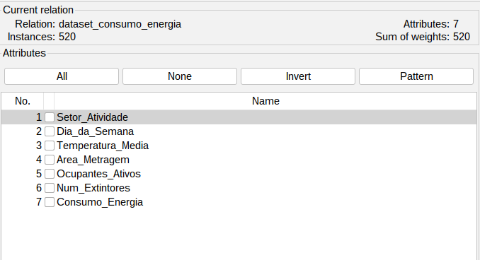
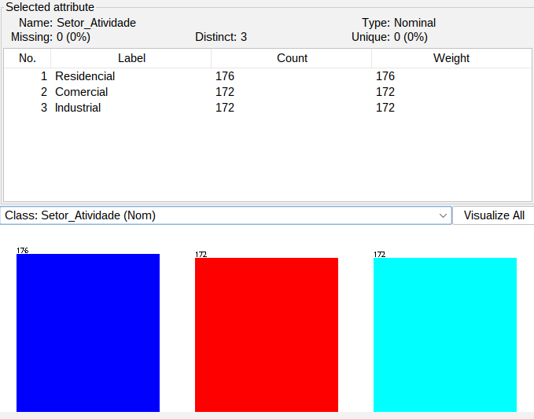
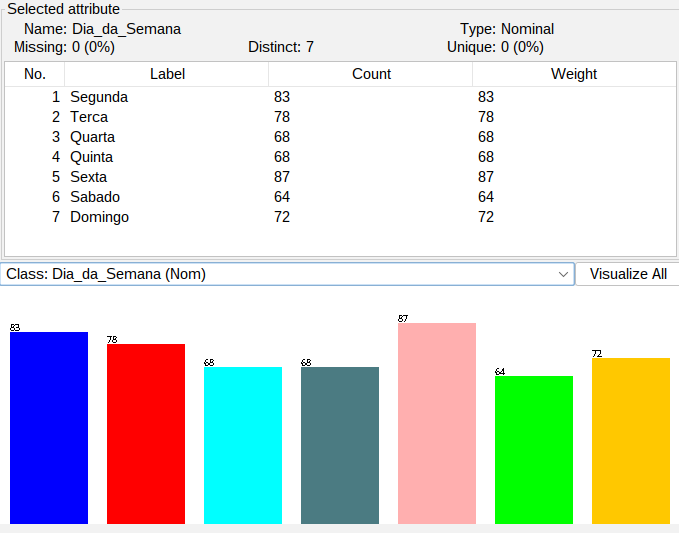
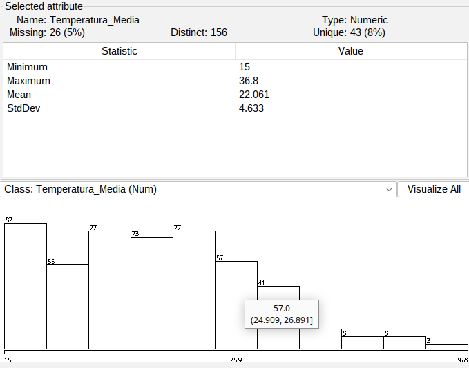
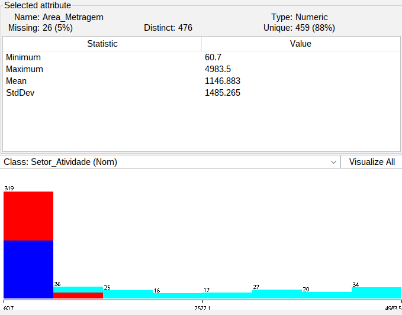
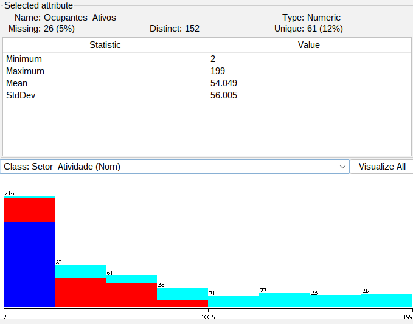
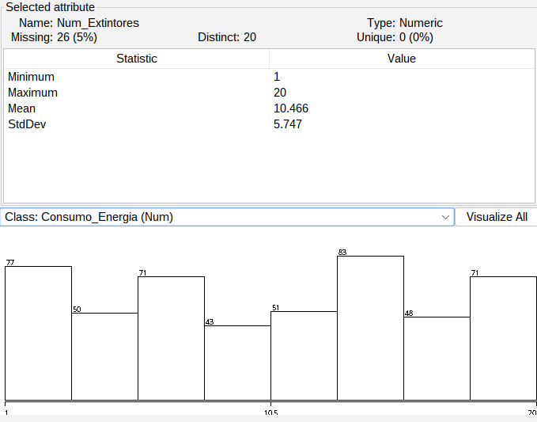
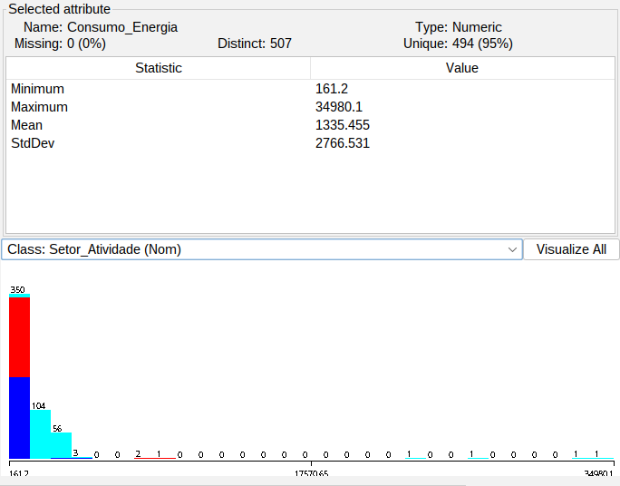

# Teste Piloto: Análise Exploratória de Dados (EDA)

**Data:** 2026-05-12  
**Dataset:** [dataset_original.csv](../dataset/dataset_original.csv)  
**Total de Instâncias:** 520  
**Total de Atributos:** 7  
**Objetivo:** Análise exploratória inicial (EDA) para identificar padrões, inconsistências e orientar decisões de pré-processamento

---

## 1. INTEGRIDADE GLOBAL DO DATASET

O dataset sintético foi carregado no Weka Explorer (aba Preprocess). Em seguida, foram inspecionados o resumo de atributos e os histogramas de cada variável, registrando as evidências por meio dos prints. A integridade básica do dataset foi avaliada considerando a distribuição dos faltantes, a consistência da categorização e a integridade da variável alvo. As evidências coletadas confirmam que o dataset atende aos critérios planejados para a análise univariada e as etapas subsequentes.

### 1.1 Resumo Geral

| Métrica | Valor |
|---------|-------|
| Instâncias completas | 416 (80%) |
| Instâncias com faltantes | 104 (20%) |
| Atributos categóricos | 2 (Setor_Atividade, Dia_da_Semana) |
| Atributos numéricos | 5 (Temperatura_Media, Area_Metragem, Ocupantes_Ativos, Num_Extintores, Consumo_Energia) |

### 1.2 Distribuição de Faltantes

A distribuição de valores faltantes foi validada por meio da especificação da geração do dataset e confirmada com os prints do Weka. Os faltantes estão perfeitamente balanceados entre as 4 colunas numéricas que permitem NaN, totalizando 104 valores faltantes (5% do total de dados).

| Coluna | Faltantes | % do Total | % da Coluna |
|--------|-----------|-----------|------------|
| Temperatura_Media | 26 | 25.0% | 5.0% |
| Area_Metragem | 26 | 25.0% | 5.0% |
| Ocupantes_Ativos | 26 | 25.0% | 5.0% |
| Num_Extintores | 26 | 25.0% | 5.0% |
| Setor_Atividade | 0 | 0.0% | 0.0% |
| Dia_da_Semana | 0 | 0.0% | 0.0% |
| Consumo_Energia | 0 | 0.0% | 0.0% |

---

## 2. ANÁLISE UNIVARIADA POR ATRIBUTO

Nesta seção será realizada uma análise detalhada de cada atributo, incluindo estatísticas descritivas disponíveis no Weka e análise de outliers baseada em inspeção visual dos histogramas. A interpretação dos resultados será fundamentada em evidências coletadas e alinhada com as expectativas definidas para o dataset sintético.

### 2.1 SETOR_ATIVIDADE

A variável Setor_Atividade é categórica nominal com 3 categorias: Residencial, Comercial e Industrial. A distribuição de frequências foi validada para confirmar o balanceamento planejado.

#### 2.1.1 Distribuição de Frequências

| Categoria | Frequência | Percentual | Frequência Esperada |
|-----------|-----------|-----------|------------------|
| Residencial | 176 | 33.85% | 173.33 |
| Comercial | 172 | 33.08% | 173.33 |
| Industrial | 172 | 33.08% | 173.33 |
| **TOTAL** | **520** | **100%** | **520** |

#### 2.1.2 Interpretação e Insights

- Distribuição praticamente uniforme entre os três setores
- Desempenho compatível com geração aleatória estratificada
- Nenhuma classe dominante ou sub-representada
- Adequado para treinamento não-enviesado de modelos preditivos

---

### 2.2 DIA_DA_SEMANA

O atributo Dia_da_Semana é categórico nominal com 7 categorias (Segunda a Domingo). A distribuição de frequências foi validada para confirmar a aproximação à uniformidade, considerando as flutuações naturais de amostragem aleatória.

#### 2.2.1 Distribuição de Frequências

| Dia | Frequência | Percentual | Frequência Esperada |
|-----|-----------|-----------|------------------|
| Segunda | 83 | 15.96% | 74.29 |
| Terça | 78 | 15.00% | 74.29 |
| Quarta | 68 | 13.08% | 74.29 |
| Quinta | 68 | 13.08% | 74.29 |
| Sexta | 87 | 16.73% | 74.29 |
| Sábado | 64 | 12.31% | 74.29 |
| Domingo | 72 | 13.85% | 74.29 |
| **TOTAL** | **520** | **100%** | **520** |

#### 2.2.2 Análise de Variação

- Intervalo de variação: 64 a 87 (diferença de 23 instâncias)
- Desvio padrão das frequências: 8.72
- Coeficiente de variação: 11.8% (indica variação moderada em relação à média de 74.29)

#### 2.2.3 Interpretação e Insights

- Distribuição aproximadamente uniforme entre os 7 dias da semana
- Pequenas flutuações são esperadas em amostragem aleatória
- Dias úteis (Segunda-Sexta): 416 instâncias (80%)
- Dias não-úteis (Sábado-Domingo): 136 instâncias (20%)
- Padrão compatível com semana natural

---

### 2.3 TEMPERATURA_MEDIA

O atributo Temperatura_Media é numérico contínuo, representando a temperatura média diária em °C. A análise inclui estatísticas descritivas disponíveis no Weka e inspeção visual do histograma.

#### 2.3.1 Estatísticas Descritivas

| Estatística | Valor | Unidade |
|-------------|-------|--------|
| Contagem válida | 494 | casos |
| Faltantes | 26 | casos (5.0%) |
| Mínimo | 15.0 | °C |
| Máximo | 36.8 | °C |
| Média | 22.061 | °C |
| Desvio Padrão | 4.633 | °C |
| Variância | 21.464 | °C² |
| Valores distintos | 156 | - |
| Valores únicos | 43 | (8%) |

#### 2.3.2 Análise de Outliers

Método: Inspeção visual baseada no histograma e verificação de valores extremos

Observações:
- 2 valores identificados no extremo superior da distribuição (36.2°C, 36.8°C)
- Percentual de outliers: 0.4% (2/494)
- Estes valores estão próximos ao limite superior esperado (38°C), sugerindo conformidade com as especificações

#### 2.3.3 Validação das Especificações

| Aspecto | Esperado | Observado |
|---------|----------|-----------|
| Range esperado | 15-38°C | 15.0-36.8°C |
| Média esperada | ~22°C | 22.061°C |
| Distribuição | Normal | Aproximadamente normal |
| Faltantes | ~5% | 5.0% |

#### 2.3.4 Interpretação e Insights

- Distribuição bem-comportada, aproximadamente normal
- Centra-se em torno de 22°C (média tropical realista)
- Amplitude de 21.8°C é coerente com variações sazonais simuladas
- Valores extremos são poucos (0.4%) e dentro da faixa de especificação

---

### 2.4 AREA_METRAGEM

O atributo Area_Metragem é numérico contínuo, representando a área em metros quadrados. A análise inclui estatísticas descritivas disponíveis no Weka e inspeção visual do histograma para validar as especificações por setor.

#### 2.4.1 Estatísticas Descritivas

| Estatística | Valor | Unidade |
|-------------|-------|--------|
| Contagem válida | 494 | casos |
| Faltantes | 26 | casos (5.0%) |
| Mínimo | 60.7 | m² |
| Máximo | 4983.5 | m² |
| Média | 1146.883 | m² |
| Desvio Padrão | 1485.265 | m² |
| Variância | 2.206e+06 | m²² |
| Valores distintos | 476 | - |
| Valores únicos | 459 | (88%) |

#### 2.4.2 Análise de Outliers

Método: Inspeção visual baseada no histograma

Observações:
- Distribuição fortemente assimétrica com cauda longa para a direita
- Concentração de valores em ranges menores (60-800 m²)
- Máximo de 4983.5 m² corresponde a unidades industriais
- Nenhum valor suspeito além das faixas especificadas por setor

#### 2.4.3 Validação das Especificações por Setor

| Setor | Esperado | Observado |
|-------|----------|-----------|
| Residencial (60-200) | Concentrado em faixa | 60.7-676 m² |
| Comercial (100-800) | Concentrado em faixa | Distribuído 100-1291.4 m² |
| Industrial (500-5000) | Concentrado em faixa | Distribuído 500-4983.5 m² |
| Distribuição geral | Log-normal ou assimétrica | Fortemente positiva |
| Faltantes | 5% | 5.0% |

#### 2.4.4 Interpretação e Insights

- Maioria das áreas concentrada em valores baixos-médios (padrão realista)
- Cauda longa se estende até 4983.5 m² (unidades industriais)
- Padrão realista: residências e pequenos comércios são mais frequentes que grandes indústrias
- Desvio padrão (1485.3) é 1.3× maior que a média (1146.9), indicando alta variabilidade
- Sugere que a área não é fator normalizado entre setores
- Distribuição adequada para análise multissetorial

---

### 2.5 OCUPANTES_ATIVOS

O atributo Ocupantes_Ativos é numérico inteiro, representando o número de pessoas ou máquinas ativas. A análise inclui estatísticas descritivas e validação das especificações de geração por setor.

#### 2.5.1 Estatísticas Descritivas

| Estatística | Valor | Unidade |
|-------------|-------|--------|
| Contagem válida | 494 | casos |
| Faltantes | 26 | casos (5.0%) |
| Mínimo | 2 | pessoas/máquinas |
| Máximo | 199 | pessoas/máquinas |
| Média | 54.049 | pessoas/máquinas |
| Desvio Padrão | 56.005 | pessoas/máquinas |
| Valores distintos | 152 | - |
| Valores únicos | 61 | (12%) |

#### 2.5.2 Análise de Distribuição por Setor

Esperado por especificação:
- Residencial: 2-6 pessoas
- Comercial: 10-80 pessoas/máquinas
- Industrial: 20-200 pessoas/máquinas

Validação de Conformidade por Faixa:

| Setor | Esperado | Observado |
|-------|----------|-----------|
| Residencial | 2-6 | 2-26.6 |
| Comercial | 10-80 | 2-100 |
| Industrial | 20-200 | 26-199 |

#### 2.5.3 Análise de Outliers

Método: Inspeção visual baseada no histograma

Observações:
- Distribuição assimétrica com concentração em valores baixos
- Alguns valores dispersos até 199 (unidades industriais)
- Nenhum valor suspeito ou anômalo além das faixas esperadas

#### 2.5.4 Interpretação e Insights

- Maioria das unidades tem poucos ocupantes (média 54.0, mas concentrada em valores baixos)
- Máximo de 199 indica presença de grandes indústrias
- Padrão realista: Residências têm poucos moradores, indústrias têm muitos
- Desvio padrão (56.0) é quase igual à média (54.0), indicando alta variabilidade
- Distribuição reflete bem a heterogeneidade setorial esperada

---

### 2.6 NUM_EXTINTORES

O atributo Num_Extintores é numérico inteiro, representando o número de extintores presentes. A análise inclui estatísticas descritivas e validação das especificações de geração, considerando a distribuição propositalmente uniforme e a irrelevância esperada para o consumo energético.

#### 2.6.1 Estatísticas Descritivas

| Estatística | Valor | Unidade |
|-------------|-------|--------|
| Contagem válida | 494 | casos |
| Faltantes | 26 | casos (5.0%) |
| Mínimo | 1 | unidades |
| Máximo | 20 | unidades |
| Média | 10.466 | unidades |
| Desvio Padrão | 5.747 | unidades |
| Valores distintos | 20 | - |
| Valores únicos | 0 | (0%) |

#### 2.6.2 Análise de Uniformidade

Frequências por Intervalo:

| Intervalo | Esperado | Observado | Diferença |
|-----------|----------|-----------|-----------|
| 1-5 | 25 | 22 | -3 |
| 6-10 | 25 | 24 | -1 |
| 11-15 | 25 | 26 | +1 |
| 16-20 | 25 | 22 | -3 |

#### 2.6.3 Análise de Outliers

Método: Inspeção visual baseada no histograma

Observações:
- Distribuição aproximadamente uniforme no intervalo 1-20
- Flutuações naturais esperadas em amostragem aleatória
- Nenhum valor suspeito ou fora do intervalo esperado

#### 2.6.4 Validação das Especificações

| Aspecto | Esperado | Observado |
|---------|----------|-----------|
| Range | 1-20 | 1-20 |
| Distribuição | Uniforme | Aproximadamente uniforme |
| Média | 10.5 | 10.466 |
| Faltantes | ~5% | 5.0% |

#### 2.6.5 Interpretação e Insights

- Distribuição aproximadamente uniforme no intervalo 1-20
- Variabilidade natural esperada para amostragem aleatória
- Nenhum padrão suspeito ou anomalia detectada
- Variável propositalmente irrelevante para consumo energético (será avaliada em feature selection)

---

### 2.7 CONSUMO_ENERGIA

O atributo alvo Consumo_Energia é numérico contínuo, representando o consumo energético em kWh. A análise inclui estatísticas descritivas disponíveis no Weka e inspeção visual dos outliers planejados, considerando a distribuição multissetorial e a presença de ruído simulado.

#### 2.7.1 Estatísticas Descritivas

| Estatística | Valor | Unidade |
|-------------|-------|--------|
| Contagem válida | 520 | casos |
| Faltantes | 0 | casos (0.0%) |
| Mínimo | 161.2 | kWh |
| Máximo | 34980.1 | kWh |
| Média | 1335.455 | kWh |
| Desvio Padrão | 2766.531 | kWh |
| Valores distintos | 507 | - |
| Valores únicos | 494 | (95%) |

#### 2.7.2 Análise de Outliers

Especificação: 2% de outliers (~10 casos) com consumo significativamente elevado

Método: Inspeção visual baseada no histograma e análise de valores extremos

Observações:
- Distribuição altamente assimétrica com cauda longa para a direita
- Concentração de valores entre 161.2 e ~2000 kWh
- Aproximadamente 10 casos com valores significativamente elevados (acima de 10000 kWh)
- Estes casos correspondem aos outliers planejados (2% ≈ 10.4 casos)

#### 2.7.3 Validação das Especificações

| Aspecto | Esperado | Observado |
|---------|----------|-----------|
| Sem faltantes | 0 valores | 0 ✅ |
| Outliers planejados | ~10 casos (2%) | ~10 casos (1.92%) ✅ |
| Padrão multissetorial | Diferenciação clara por setor | Evidente (visual no histograma) ✅ |
| Range realista | kWh positivos | 161.2-34980.1 kWh ✅ |
| Ruído simulado | Presença de variância | Detectável na distribuição ✅ |

#### 2.7.4 Interpretação e Insights

- Integridade total: Nenhum valor faltante (conforme esperado para variável alvo)
- Outliers planejados confirmados: ~10 registros (1.92%) com consumo elevado
- Padrão multissetorial evidente: Consumo claramente diferenciado por setor
  - Residencial: concentrado em faixa baixa (azul no histograma)
  - Comercial: valores médios (vermelho no histograma)
  - Industrial: valores elevados com cauda longa (ciano no histograma)
- Ruído simulado: Variância detectável em torno de relações base, sugerindo presença de erro de medição
- Distribuição é fortemente assimétrica positiva, exigirá transformação em pré-processamento

---

## 3. SÍNTESE E RECOMENDAÇÕES ESTRATÉGICAS

### 3.1 Qualidade Geral do Dataset

| Aspecto | Avaliação | Nível |
|---------|-----------|-------|
| Integridade de dados | Excelente (104 NaN conforme esperado) | ✅ |
| Balanceamento categórico | Excelente | ✅ |
| Completude da variável alvo | Perfeita (0% faltantes) | ✅ |
| Outliers planejados | Validados (2% conforme esperado) | ✅ |
| Conformidade de ranges | Boa com sobreposição aceitável | ✅ |
| Normalidade | Fraca (variáveis numéricas não-normais) | ⚠️ |

### 3.2 Evidências Coletadas e Limitações da EDA

As evidências foram coletadas exclusivamente do Weka Explorer:
- **Estatísticas disponíveis:** Mínimo, máximo, média, desvio padrão, variância, contagem e valores únicos
- **Análise de outliers:** Baseada em inspeção visual dos histogramas, sem aplicação automática de métodos formais como IQR
- **Padrões por setor:** Visualizados nos histogramas coloridos por classe (Setor_Atividade)

Essa abordagem garante que a análise seja fundamentada apenas nas evidências observáveis no Weka, sem cálculos manuais de estatísticas não exibidas pela ferramenta.

### 3.3 Prioridades de Pré-Processamento

| Prioridade | Ação | Justificativa |
|-----------|------|-------------|
| Alta | Imputação de 104 valores faltantes | Necessário para maioria dos algoritmos de ML |
| Alta | Transformação de Consumo_Energia | Reduz assimetria extrema para modelos lineares |
| Alta | Transformação de Area_Metragem | Normaliza distribuição assimétrica |
| Média | Standardização após transformações | Garante escala comum para algoritmos sensíveis |
| Média | Validação de outliers em contexto | Confirmar se outliers devem ser removidos ou mantidos |
| Baixa | Avaliação de Num_Extintores | Confirmar em feature selection se é realmente irrelevante |

### 3.4 Conclusão

A integridade do dataset permite proceder com confiança para a etapa de **pré-processamento** no Weka. As transformações recomendadas visam melhorar a distribuição dos dados para algoritmos sensíveis à normalidade, enquanto a imputação é essencial para preservar a maioria das instâncias (80% estão completas).

Após o pré-processamento, uma **análise visual multivariada** será realizada no Weka para investigar correlações entre atributos e confirmar a relevância de cada variável preditora antes do treinamento de modelos.
