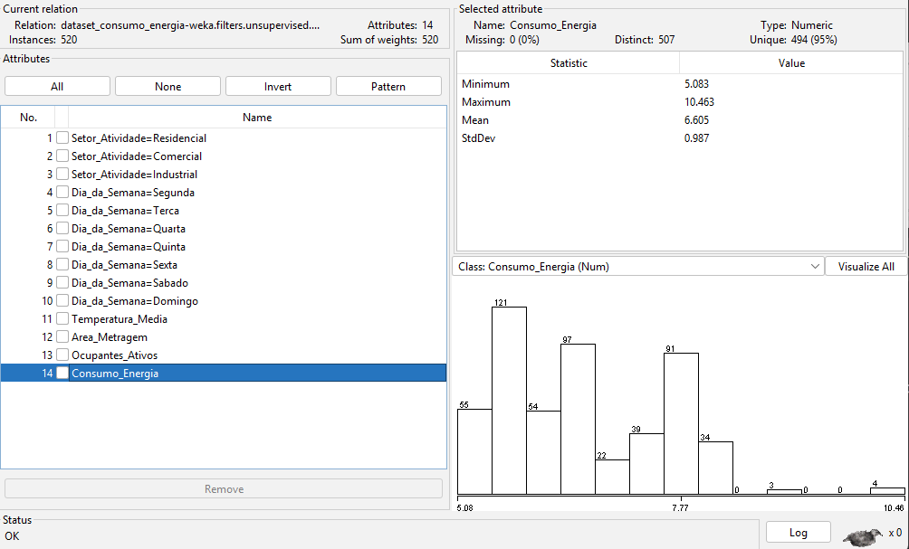
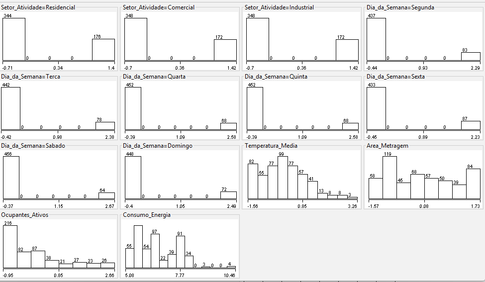

# Análise de Correlações e Visualização de Dados

## 1. Introdução
Este documento apresenta a etapa de análise visual e estatística do conjunto de dados voltado à predição de consumo de energia elétrica, como parte integrante da disciplina de Inteligência Artificial. O objetivo central desta fase é utilizar a visualização como uma ferramenta analítica para identificar padrões, validar a integridade do pré-processamento e fundamentar a escolha dos modelos de aprendizado de máquina que serão treinados posteriormente.

## 2. Metodologia
A análise foi realizada utilizando o software **WEKA (v3.8.6)**, explorando as abas *Preprocess* e *Visualize*. O conjunto de dados utilizado passou por um rigoroso processo de pré-processamento, incluindo:
* **Tratamento de valores faltantes** (*ReplaceMissingValues*);
* **Transformação Logarítmica** (*MathExpression*) na variável alvo para reduzir a assimetria;
* **Binarização** (*NominalToBinary*) de atributos categóricos;
* **Padronização** (*Standardize*) via Z-score para equalizar as escalas dos atributos numéricos.

## 3. Análise de Distribuições
A primeira etapa consistiu em validar a forma das distribuições após o tratamento estatístico.

### 3.1. Panorama Global
Através do recurso *Visualize All*, verificou-se que a padronização garantiu que todos os atributos numéricos apresentassem média próxima de zero e desvio padrão unitário. Isso é crucial para algoritmos sensíveis à escala, como Redes Neurais e KNN.

### 3.2. Variável Alvo: Consumo de Energia
A análise do histograma do atributo `Consumo_Energia` demonstra que a distribuição logarítmica permitiu uma visualização mais equilibrada das instâncias. Diferente do dado bruto, onde valores extremos de grandes indústrias dominariam o gráfico, a escala logarítmica permite identificar padrões de consumo em diferentes magnitudes de carga.

## 4. Análise de Correlações Bivariadas
Utilizou-se a matriz de dispersão (*Scatter Plots*) para identificar como as variáveis independentes influenciam o consumo.

### 4.1. Área Metragem vs. Consumo
Esta correlação apresentou a relação linear mais robusta do dataset. Observa-se uma tendência ascendente nítida: quanto maior a área física do imóvel, maior o consumo energético. A linearidade observada nesta relação valida a aplicação prévia do filtro logarítmico.

### 4.2. Temperatura Média vs. Consumo
Identificou-se uma correlação positiva entre a temperatura e o consumo. Em contextos climáticos elevados, como na região amazônica, este comportamento é fisicamente esperado devido ao aumento da demanda por sistemas de refrigeração e climatização.

### 4.3. Influência do Setor de Atividade
Ao analisar o setor residencial binarizado contra o consumo, a separação de classes torna-se evidente. A utilização de cores (Laranja para Industrial e Azul para Residencial/Comercial) revela que o setor industrial domina os quadrantes de alto consumo e alta metragem, enquanto os demais perfis agrupam-se em escalas inferiores.

## 5. Interpretação dos Gráficos e Implicações para o Modelo
A análise da **Matriz Geral de Dispersão** com a aplicação de *Jitter* permitiu identificar a densidade das instâncias mesmo em atributos binários. 

As principais interpretações são:
1. **Linearidade**: A forte correlação linear entre Área e Temperatura com o Consumo sugere que modelos baseados em regressão (Linear Regression, M5P) terão um desempenho superior.
2. **Clusterização Natural**: A clara separação visual entre os setores indica que algoritmos baseados em árvores (Random Forest) ou em instâncias (KNN) conseguirão classificar os perfis de consumo com alta precisão.
3. **Estabilidade Estatística**: A ausência de "esmagamento" dos pontos nos gráficos prova que o pré-processamento removeu o viés de outliers, preparando o terreno para uma convergência mais rápida dos algoritmos de aprendizado.

## 6. Conclusões Finais
A etapa de visualização confirmou que o dataset está estatisticamente preparado para a fase de modelagem. As correlações identificadas não são apenas estatisticamente significativas, mas também logicamente coerentes com o domínio do problema (consumo elétrico regional). 
