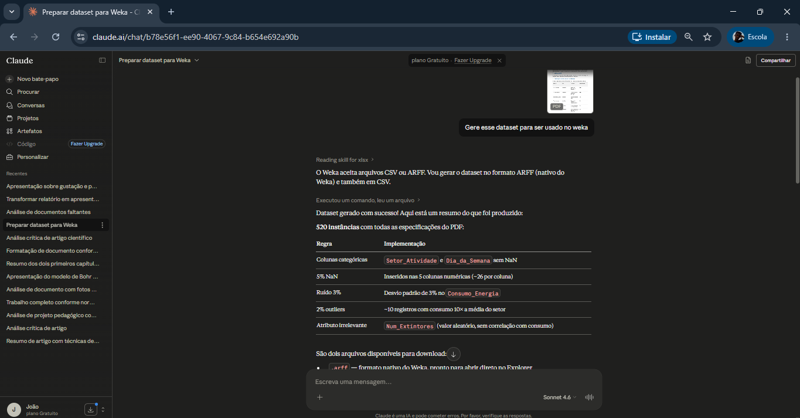
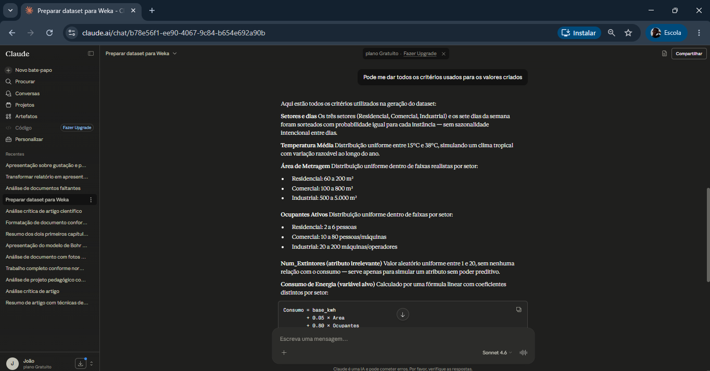
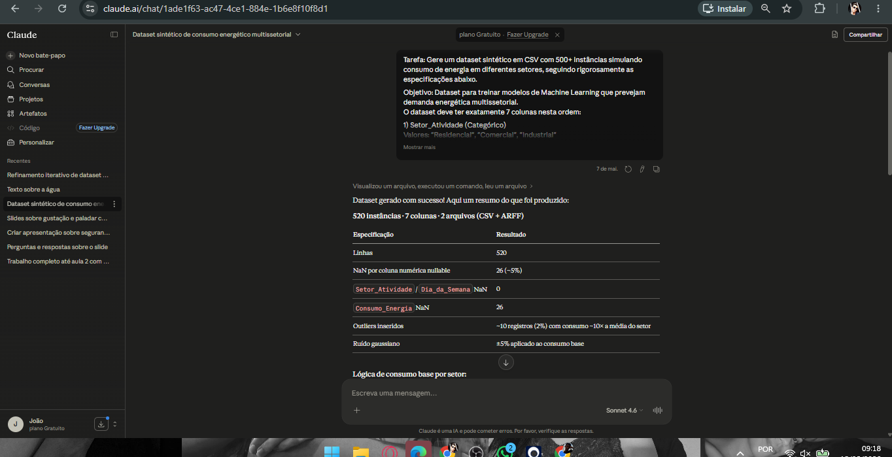
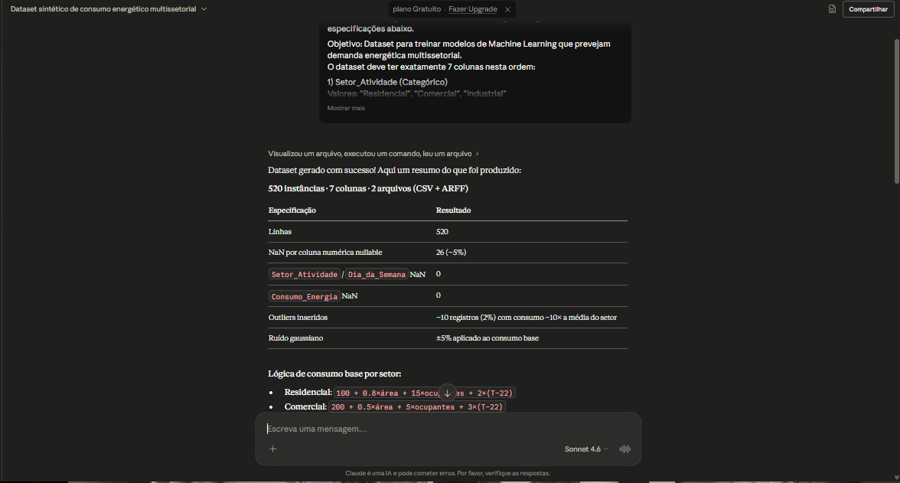

# Documentação: Geração do Dataset Sintético de Consumo de Energia

**Link do prompt:** [dataset sintético do consumo de energia multisetorial](https://claude.ai/share/d0e5655a-948e-45ed-a7aa-5e47ec8285ca)

**Arquivo gerado:** `dataset_consumo_energia.csv` / `dataset_consumo_energia.arff`  
**Total de instâncias:** 520  
**Total de colunas:** 7  
**Objetivo:** Treinamento de modelos de Machine Learning para previsão de demanda energética multissetorial

---

## 1. Visão Geral

O dataset simula o consumo de energia elétrica em três setores de atividade (Residencial, Comercial e Industrial), incorporando variáveis contextuais como temperatura, área da unidade e número de ocupantes. O processo de geração foi inteiramente feito em Python com as bibliotecas `pandas` e `numpy`, seguindo especificações rigorosas de distribuição estatística, injeção de ruído e inserção de outliers.

A construção do dataset foi conduzida de forma iterativa por meio de três versões de prompt enviadas ao modelo de linguagem **Claude Sonnet 4.6** (Anthropic). Cada prompt refinou as especificações anteriores, tornando o processo rastreável e metodologicamente rigoroso.

---

## 2. Histórico de Prompts

### Prompt 1 — Geração Inicial

O primeiro prompt foi intencionalmente simples e foi enviado junto ao documento de especificações do trabalho. O objetivo era obter uma versão inicial do dataset para avaliar o que o modelo geraria sem instruções detalhadas, servindo como ponto de partida para os refinamentos seguintes.

> **"Gere esse dataset para ser usado no weka"**

Este prompt produziu um dataset funcional, mas sem controle rigoroso sobre distribuições, faixas de valores por setor, porcentagem de NaN, nem separação clara entre variável-alvo e atributos com valores ausentes.

---

### Prompt 2 — Refinamento das Especificações

Após analisar os critérios da atividade com mais atenção, o segundo prompt foi estruturado com especificações detalhadas para cada coluna, incluindo faixas de valores por setor, percentual de NaN, tipo de ruído e padrão de outliers. O objetivo era gerar um dataset com controle semântico e estatístico explícito.

Durante a análise do dataset gerado por este prompt no **Weka Web** e no **Weka Desktop**, foram observados dois pontos: (1) o atributo `Dia_da_Semana` apresentava distribuição não balanceada, o que foi mantido intencionalmente para simular uma característica realista a ser tratada no pré-processamento; (2) a variável-alvo `Consumo_Energia` permitia NaN, o que foi identificado como inconsistência, pois a coluna alvo não deve ter valores ausentes.

---

### Prompt 3 — Correção da Variável-Alvo

O terceiro prompt foi praticamente idêntico ao segundo, com uma única alteração: a coluna `Consumo_Energia` passou de `Permite NaN: SIM` para `Permite NaN: NÃO`. Esta correção garantiu que a variável-alvo ficasse 100% completa, como esperado em problemas de regressão supervisionada.

---

## 3. Estrutura das Colunas

| # | Coluna | Tipo | Descrição |
|---|--------|------|-----------|
| 1 | `Setor_Atividade` | Categórico | Setor da unidade consumidora |
| 2 | `Dia_da_Semana` | Categórico | Dia da semana da medição |
| 3 | `Temperatura_Media` | Numérico (float) | Temperatura média do dia em °C |
| 4 | `Area_Metragem` | Numérico (float) | Área da unidade em m² |
| 5 | `Ocupantes_Ativos` | Numérico (inteiro) | Pessoas ou máquinas em operação |
| 6 | `Num_Extintores` | Numérico (inteiro) | Atributo irrelevante (ruído de domínio) |
| 7 | `Consumo_Energia` | Numérico (float) | **Variável-alvo** — consumo em kWh |

---

## 4. Geração de Cada Coluna

### 4.1 `Setor_Atividade`

> **Especificação definida no Prompt 2 — mantida sem alteração no Prompt 3.**

Sorteio aleatório uniforme entre os três setores com `numpy.random.choice`, sem peso diferenciado, resultando em distribuição aproximadamente igual (~173 instâncias por setor).

```python
# Código gerado pelo Claude (claude-sonnet-4-6)
setores = np.random.choice(["Residencial", "Comercial", "Industrial"], size=N)
```

Valores possíveis: `Residencial`, `Comercial`, `Industrial`  
Permite NaN: **Não**

---

### 4.2 `Dia_da_Semana`

> **Especificação definida no Prompt 2 — mantida sem alteração no Prompt 3.**

Sorteio aleatório uniforme entre os sete dias da semana. Durante a validação no Weka, observou-se distribuição não perfeitamente balanceada, característica mantida intencionalmente para aproximar o dataset de condições reais, sendo a correção desse desequilíbrio responsabilidade do pré-processamento.

```python
# Código gerado pelo Claude (claude-sonnet-4-6)
dias = np.random.choice(
    ["Segunda","Terça","Quarta","Quinta","Sexta","Sábado","Domingo"],
    size=N
)
```

Distribuição esperada: ~74 instâncias por dia  
Permite NaN: **Não**

---

### 4.3 `Temperatura_Media`

> **Especificação definida no Prompt 2 — mantida sem alteração no Prompt 3.**

Gerada com distribuição **normal** (gaussiana), com média de 22°C e desvio padrão de 5°C. Após a geração, os valores são clipados ao intervalo realista de 15°C a 38°C.

```python
# Código gerado pelo Claude (claude-sonnet-4-6)
temp = np.random.normal(22, 5, N)
temp = np.clip(temp, 15, 38).round(1)
```

| Parâmetro | Valor |
|-----------|-------|
| Distribuição | Normal |
| Média | 22°C |
| Desvio padrão | 5°C |
| Mínimo (clip) | 15°C |
| Máximo (clip) | 38°C |
| Casas decimais | 1 |

Permite NaN: **Sim** (5%)

---

### 4.4 `Area_Metragem`

> **Especificação definida no Prompt 2 — mantida sem alteração no Prompt 3.**

Gerada com distribuição uniforme dentro de faixas específicas por setor, refletindo o porte típico de cada tipo de unidade.

```python
# Código gerado pelo Claude (claude-sonnet-4-6)
for i, s in enumerate(setores):
    if s == "Residencial": area[i] = np.random.uniform(60, 200)
    elif s == "Comercial":  area[i] = np.random.uniform(100, 800)
    else:                   area[i] = np.random.uniform(500, 5000)
```

| Setor | Faixa (m²) |
|-------|-----------|
| Residencial | 60 – 200 |
| Comercial | 100 – 800 |
| Industrial | 500 – 5.000 |

Permite NaN: **Sim** (5%)

---

### 4.5 `Ocupantes_Ativos`

> **Especificação definida no Prompt 2 — mantida sem alteração no Prompt 3.**

Número inteiro gerado com distribuição uniforme discreta por setor. Representa pessoas (residencial/comercial) ou máquinas em operação (industrial).

```python
# Código gerado pelo Claude (claude-sonnet-4-6)
for i, s in enumerate(setores):
    if s == "Residencial": ocup[i] = np.random.randint(2, 7)
    elif s == "Comercial":  ocup[i] = np.random.randint(10, 81)
    else:                   ocup[i] = np.random.randint(20, 201)
```

| Setor | Faixa |
|-------|-------|
| Residencial | 2 – 6 |
| Comercial | 10 – 80 |
| Industrial | 20 – 200 |

Permite NaN: **Sim** (5%)

---

### 4.6 `Num_Extintores`

> **Especificação definida no Prompt 2 — mantida sem alteração no Prompt 3.**

Atributo **deliberadamente irrelevante**, inserido para simular ruído de domínio e testar a capacidade dos modelos de ML de descartar features sem poder preditivo. Gerado com distribuição uniforme discreta entre 1 e 20, sem qualquer relação com o consumo.

```python
# Código gerado pelo Claude (claude-sonnet-4-6)
extin = np.random.randint(1, 21, size=N).astype(float)
```

Permite NaN: **Sim** (5%)

---

### 4.7 `Consumo_Energia` (Variável-Alvo)

> **Especificação alterada entre Prompt 2 e Prompt 3.**  
> No Prompt 2: `Permite NaN: SIM`  
> No Prompt 3: `Permite NaN: NÃO` ← versão final adotada

O consumo é calculado em três etapas: **cálculo base determinístico**, **adição de ruído gaussiano** e **injeção de outliers**.

#### Etapa 1 — Fórmula base por setor

Cada setor possui uma equação linear que combina área, ocupantes e temperatura:

| Setor | Fórmula |
|-------|---------|
| Residencial | `100 + 0.8 × área + 15 × ocupantes + 2 × (T − 22)` |
| Comercial | `200 + 0.5 × área + 5 × ocupantes + 3 × (T − 22)` |
| Industrial | `500 + 0.3 × área + 8 × ocupantes + 5 × (T − 22)` |

O termo `(T − 22)` captura o efeito da temperatura em relação à média histórica de 22°C, com sensitividade crescente do setor residencial ao industrial.

#### Etapa 2 — Ruído gaussiano

Após o cálculo base, é somado ruído gaussiano proporcional ao consumo de cada instância (5% de desvio padrão), simulando erros de medição realistas:

```python
# Código gerado pelo Claude (claude-sonnet-4-6)
consumo += np.random.normal(0, consumo * 0.05)
consumo = np.abs(consumo).round(1)
```

#### Etapa 3 — Outliers (ver Seção 5)

Permite NaN: **Não** — a variável-alvo não possui valores ausentes.

---

## 5. Outliers

> **Especificação definida no Prompt 2 — mantida sem alteração no Prompt 3.**

Foram injetados outliers em aproximadamente **2% das instâncias** (~10 registros), com consumo igual a **10× a média típica do setor**, mais variação gaussiana. O objetivo é simular consumos anômalos para teste de robustez dos modelos.

```python
# Código gerado pelo Claude (claude-sonnet-4-6)
n_outliers = int(N * 0.02)
outlier_idx = np.random.choice(N, n_outliers, replace=False)
for i in outlier_idx:
    s = setores[i]
    if s == "Residencial": mean_s = 350
    elif s == "Comercial":  mean_s = 800
    else:                   mean_s = 3000
    consumo[i] = mean_s * 10 + np.random.normal(0, mean_s)
```

| Setor | Média típica (kWh) | Consumo outlier (~10×) |
|-------|-------------------|------------------------|
| Residencial | ~350 | ~3.500 |
| Comercial | ~800 | ~8.000 |
| Industrial | ~3.000 | ~30.000 |

Os outliers são distribuídos aleatoriamente entre as linhas e setores, sem concentração intencional.

---

## 6. Valores Ausentes (NaN)

> **Especificação definida no Prompt 2 — mantida sem alteração no Prompt 3.**

Exatamente **5% de NaN** foi inserido aleatoriamente nas quatro colunas numéricas que permitem valores ausentes. A distribuição é independente por coluna, ou seja, diferentes linhas recebem NaN em cada atributo.

```python
# Código gerado pelo Claude (claude-sonnet-4-6)
nan_cols = ["Temperatura_Media", "Area_Metragem", "Ocupantes_Ativos", "Num_Extintores"]
n_nan_per_col = int(N * 0.05)  # = 26 por coluna
for col in nan_cols:
    nan_idx = np.random.choice(N, n_nan_per_col, replace=False)
    df.loc[nan_idx, col] = np.nan
```

| Coluna | NaN inseridos | % do total |
|--------|--------------|-----------|
| `Temperatura_Media` | 26 | 5,0% |
| `Area_Metragem` | 26 | 5,0% |
| `Ocupantes_Ativos` | 26 | 5,0% |
| `Num_Extintores` | 26 | 5,0% |
| `Setor_Atividade` | 0 | 0% |
| `Dia_da_Semana` | 0 | 0% |
| `Consumo_Energia` | 0 | 0% |

---

## 7. Formato de Saída

### 7.1 CSV (`dataset_consumo_energia.csv`)

| Especificação | Valor |
|---------------|-------|
| Separador | vírgula (`,`) |
| Encoding | UTF-8 |
| Separador decimal | ponto (`.`) |
| Cabeçalho | Sim (primeira linha) |
| Índice de linha | Não |
| NaN representado por | célula vazia |

### 7.2 ARFF (`dataset_consumo_energia.arff`)

Formato compatível com **Weka** e ferramentas de ML que utilizam o padrão ARFF (Attribute-Relation File Format).

Adaptações realizadas para compatibilidade ARFF:
- Acentos removidos nas categorias: `Terça → Terca`, `Sábado → Sabado`
- Valores ausentes representados por `?` (padrão ARFF)
- Colunas categóricas declaradas com `{valor1,valor2,...}`
- Colunas numéricas declaradas como `NUMERIC`

Exemplo do cabeçalho ARFF gerado:

```
# Código gerado pelo Claude (claude-sonnet-4-6)
@RELATION dataset_consumo_energia

@ATTRIBUTE Setor_Atividade {Residencial,Comercial,Industrial}
@ATTRIBUTE Dia_da_Semana {Segunda,Terca,Quarta,Quinta,Sexta,Sabado,Domingo}
@ATTRIBUTE Temperatura_Media NUMERIC
@ATTRIBUTE Area_Metragem NUMERIC
@ATTRIBUTE Ocupantes_Ativos NUMERIC
@ATTRIBUTE Num_Extintores NUMERIC
@ATTRIBUTE Consumo_Energia NUMERIC

@DATA
...
```

---

## 8. Reprodutibilidade

A semente aleatória foi fixada em `42` via `numpy.random.seed(42)`, garantindo que o dataset possa ser reproduzido identicamente em qualquer execução com o mesmo código.

```python
# Código gerado pelo Claude (claude-sonnet-4-6)
np.random.seed(42)
```

---

## 9. Dependências

| Biblioteca | Versão recomendada | Uso |
|------------|--------------------|-----|
| `numpy` | ≥ 1.23 | Geração de números aleatórios e operações vetoriais |
| `pandas` | ≥ 1.5 | Construção do DataFrame, NaN e exportação CSV |

---

## 10. Exemplo das Primeiras Linhas

```
Setor_Atividade,Dia_da_Semana,Temperatura_Media,Area_Metragem,Ocupantes_Ativos,Num_Extintores,Consumo_Energia
Industrial,Segunda,20.1,3736.4,51,14,1931.6
Residencial,Segunda,18.7,92.0,,15,208.1
Industrial,Terça,29.0,4983.5,31,15,2142.6
Industrial,Quarta,15.5,4886.6,194,9,3771.8
Residencial,Quinta,15.0,151.0,,19,240.5
```

---

## 11. Considerações para Uso em ML

- A coluna `Num_Extintores` é um **atributo irrelevante** intencional — modelos com seleção de features devem descartá-la.
- Os **~10 outliers** podem ser tratados ou removidos dependendo da estratégia adotada (robustez vs. acurácia em dados limpos).
- Os **NaN** demandam estratégia de imputação antes do treinamento (média, mediana, KNN imputer, etc.).
- A variável `Consumo_Energia` é contínua, portanto o problema é de **regressão**.
- As variáveis categóricas (`Setor_Atividade`, `Dia_da_Semana`) precisam de encoding (One-Hot, Label ou Ordinal) conforme o algoritmo utilizado.
- O desbalanceamento no atributo `Dia_da_Semana`, identificado na validação no Weka, foi mantido intencionalmente para simular uma condição real do dado.

---

## 12. Prompts Utilizados

### Prompt 1

```
Gere esse dataset para ser usado no weka
```

---

### Prompt 2

```
Tarefa: Gere um dataset sintético em CSV com 500+ instâncias simulando consumo de energia em diferentes setores, seguindo rigorosamente as especificações abaixo.

Objetivo: Dataset para treinar modelos de Machine Learning que prevejam demanda energética multissetorial.
O dataset deve ter exatamente 7 colunas nesta ordem:

1) Setor_Atividade (Categórico)
Valores: "Residencial", "Comercial", "Industrial"

2) Dia_da_Semana (Categórico)
Valores: "Segunda", "Terça", "Quarta", "Quinta", "Sexta", "Sábado", "Domingo"
Distribuido uniforme 

3) Temperatura_Media (Numérico)
Range realista: 15°C e 38°C
Distribuição: normal com média 22°C
Permite NaN: SIM

4) Area_Metragem (Numérico)
Tamanho da unidade em m²
Residencial: 60-200 m²
Comercial: 100-800 m²
Industrial: 500-5000 m²
Permite NaN: SIM

5) Ocupantes_Ativos (Numérico inteiro)
Pessoas/máquinas em operação
Residencial: 2-6
Comercial: 10-80
Industrial: 20-200
Permite NaN: SIM (até 5%)

6) Num_Extintores (Numérico inteiro)
Número de extintores (atributo irrelevante)
Range: 1-20
Permite NaN: SIM (até 5%)

7) Consumo_Energia (Numérico - ALVO)
Medido em kWh
Permite NaN: sim

Inserir exatamente 5% de NaN aleatoriamente
Distribuição: igual em todas as 5 colunas numéricas
Aplicação: aleatória em diferentes linhas
Exceção: Setor_Atividade e Dia_da_Semana devem estar 100% completos
2 RUÍDO ESTATÍSTICO
Tipo: Ruído gaussiano
Alvo: coluna Consumo_Energia
Efeito: simula erros de medição realistas
Aplicação: após cálculo base de consumo
3 OUTLIERS

Quantidade: 2% das quantidade de linhas totais = ~10 registros
Padrão: Consumo 10x acima da média do setor
Distribuição: aleatória entre setores

Objetivo: simular consumo anômalo
4 FORMATO DE SAÍDA OBRIGATÓRIO
Arquivo: dataset_consumo_energia.csv e dataset_consumo_energia.arff
Especificações:
Separador: vírgula (,)
Encoding: UTF-8
Decimal: ponto (.)
Com cabeçalho (primeira linha = nomes das colunas)
Sem índice de linha

Exemplo das 5 primeiras linhas:
Setor_Atividade,Dia_da_Semana,Temperatura_Media,Area_Metragem,Ocupantes_Ativos,Num_Extintores,Consumo_Energia
Residencial,Segunda,22.5,120.0,4,2,235.8
Comercial,Terça,18.3,450.0,12.0,5,512.7
Industrial,Quarta,25.1,1200.0,,3,2156.3
Residencial,Quinta,,85.5,3,1,189.2
Comercial,Sexta,20.0,380.0,11,4,498.5
```

---

### Prompt 3

```
Tarefa: Gere um dataset sintético em CSV com 500+ instâncias simulando consumo de energia em diferentes setores, seguindo rigorosamente as especificações abaixo.

Objetivo: Dataset para treinar modelos de Machine Learning que prevejam demanda energética multissetorial.
O dataset deve ter exatamente 7 colunas nesta ordem:

1) Setor_Atividade (Categórico)
Valores: "Residencial", "Comercial", "Industrial"

2) Dia_da_Semana (Categórico)
Valores: "Segunda", "Terça", "Quarta", "Quinta", "Sexta", "Sábado", "Domingo"

3) Temperatura_Media (Numérico)
Range realista: 15°C e 38°C
Distribuição: normal com média 22°C
Permite NaN: SIM (até 5%)

4) Area_Metragem (Numérico)
Tamanho da unidade em m²
Residencial: 60-200 m²
Comercial: 100-800 m²
Industrial: 500-5000 m²
Permite NaN: SIM (até 5%)

5) Ocupantes_Ativos (Numérico inteiro)
Pessoas/máquinas em operação
Residencial: 2-6
Comercial: 10-80
Industrial: 20-200
Permite NaN: SIM (até 5%)

6) Num_Extintores (Numérico inteiro)
Número de extintores (atributo irrelevante)
Range: 1-20
Permite NaN: SIM (até 5%)

7) Consumo_Energia (Numérico - ALVO)
Medido em kWh
Permite NaN: NÂO

Inserir exatamente 5% de NaN aleatoriamente
Distribuição: igual em todas as 5 colunas numéricas
Aplicação: aleatória em diferentes linhas
Exceção: Setor_Atividade e Dia_da_Semana devem estar 100% completos
2 RUÍDO ESTATÍSTICO
Tipo: Ruído gaussiano
Alvo: coluna Consumo_Energia
Efeito: simula erros de medição realistas
Aplicação: após cálculo base de consumo
3 OUTLIERS

Quantidade: 2% das quantidade de linhas totais = ~10 registros
Padrão: Consumo 10x acima da média do setor
Distribuição: aleatória entre setores

Objetivo: simular consumo anômalo
4 FORMATO DE SAÍDA OBRIGATÓRIO
Arquivo: dataset_consumo_energia.csv e dataset_consumo_energia.arff
Especificações:
Separador: vírgula (,)
Encoding: UTF-8
Decimal: ponto (.)
Com cabeçalho (primeira linha = nomes das colunas)
Sem índice de linha

Exemplo das 5 primeiras linhas:
Setor_Atividade,Dia_da_Semana,Temperatura_Media,Area_Metragem,Ocupantes_Ativos,Num_Extintores,Consumo_Energia
Residencial,Segunda,22.5,120.0,4,2,235.8
Comercial,Terça,18.3,450.0,12.0,5,512.7
Industrial,Quarta,25.1,1200.0,,3,2156.3
Residencial,Quinta,,85.5,3,1,189.2
Comercial,Sexta,20.0,380.0,11,4,498.5
```

---

## 13. Fluxo de Geração — Prints do Processo


**Prompt 01** — *( Prompt 1 sendo enviado ao Claude)*



---

**Coleta de Dados** — *(Coletando os critérios do Cluade)*



---

**Prompt 02** — *(Prompt 2 sendo enviado ao Claude)*



---

**Prompt 03** — *(Prompt 3 sendo enviado ao Claude)*



