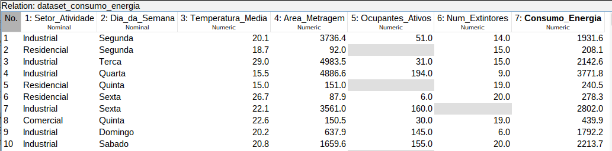
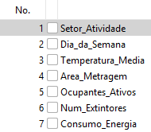
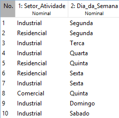

# Procedimento de Pré-processamento dos Dados no Weka

O pré-processamento do dataset foi realizado na aba Preprocess do software Weka
, utilizando uma sequência de filtros aplicados com o objetivo de melhorar a qualidade dos dados antes da etapa de
treinamento dos modelos de Machine Learning.

As etapas executadas são descritas a seguir.

## 1. Imputação de Valores Faltantes

Inicialmente, foi realizado o tratamento dos valores ausentes presentes no conjunto de dados. Para isso, utilizou-se o
filtro:

```
unsupervised.attribute.ReplaceMissingValues
```

Usando essa configuração ilustrada na figura abaixo:


Esse filtro foi aplicado com a finalidade de substituir automaticamente os valores faltantes existentes nos atributos do
dataset. Em atributos numéricos, a substituição foi realizada pela média dos valores observados, enquanto em atributos
nominais foi utilizada a categoria mais frequente.

Após a aplicação do filtro, o conjunto de dados passou a não apresentar valores NaN, garantindo maior consistência para
as etapas posteriores do processamento.

dataset com valores faltantes:



dataset sem valores faltantes:


## 2. Transformação Logarítmica dos Atributos

Na sequência, realizou-se a transformação logarítmica dos atributos relacionados à área e ao consumo energético, com o
objetivo de reduzir a assimetria das distribuições e minimizar o impacto de valores extremos.

Antes da aplicação do filtro, foi necessário definir a opção ``No class`` na caixa de seleção de classe localizada no
canto inferior esquerdo da interface do Weka. Essa configuração foi utilizada para evitar que o atributo alvo fosse
tratado de maneira diferenciada durante a transformação.

Posteriormente, aplicou-se o filtro:

```
unsupervised.attribute.MathExpression
```

Usando essa configuração ilustrada na figura abaixo:


fazendo com que a transformação fosse aplicada apenas aos atributos correspondentes à área e ao consumo de energia.

Após essa etapa, os atributos passaram a apresentar distribuição mais equilibrada, reduzindo a influência de outliers no
processo de modelagem.

Histograma dos atributos antes da transformação logarítmica:


Histograma dos atributos após a transformação logarítmica:


## 3. Remoção de Atributo Irrelevante

Em seguida, foi realizada a remoção de atributos considerados irrelevantes para o problema analisado.

Para essa finalidade, utilizou-se o filtro:

```
unsupervised.attribute.Remove
```

Usando essa configuração ilustrada na figura abaixo:


A exclusão desse atributo foi motivada pela ausência de relação direta entre a quantidade de extintores e o consumo de
energia elétrica, evitando assim a introdução de ruídos no treinamento dos modelos.

Após a aplicação do filtro, o dataset passou a conter apenas atributos considerados relevantes para a análise.

Atributos antes da remoção:



Atributos após a remoção:


OBS: A variavel alvo passou a ter o indice 6!

## 4. Conversão de Variáveis Categóricas

Posteriormente, foi realizada a transformação das variáveis categóricas em atributos binários, de modo a adequar os
dados aos algoritmos de aprendizado supervisionado.

Foi utilizado o filtro:

```
unsupervised.attribute.NominalToBinary
```

Usando essa configuração ilustrada na figura abaixo:


Os indices 1 e 2 correspondem aos atributos ``Setor_Atividade`` e ``Dia_da_Semana``, respectivamente, que foram
convertidos em variáveis binárias.

Com essa configuração, cada categoria passou a ser representada por uma coluna binária independente, permitindo que os
algoritmos interpretassem corretamente as informações sem criar relações ordinais artificiais entre as categorias.

Após a transformação, o dataset apresentou expansão no número de atributos devido à criação das novas variáveis
binárias.

Atributos antes da conversão:



Atributos após a conversão:

- Setor_Atividade:


- Dia_da_Semana:


## 5. Padronização dos Dados

Por fim, foi realizada a etapa de padronização dos atributos numéricos.

Antes da aplicação do filtro, o atributo alvo ``Consumo_Energia`` foi definido como classe, garantindo que ele não fosse
afetado pelo processo de padronização.

Em seguida, foi aplicado o filtro:

```
unsupervised.attribute.Standardize
```

A configuração utilizada para a padronização dos dados foi a configuração padrão do filtro, sem a necessidade de ajustes
adicionais, conforme ilustrado na figura abaixo:

Esse procedimento teve como objetivo transformar os atributos para uma escala padronizada com:

* média igual a 0;
* desvio padrão igual a 1.

A padronização foi necessária devido às diferenças de magnitude existentes entre os atributos do dataset, evitando que
variáveis com valores maiores exercessem influência excessiva no treinamento dos modelos.

Após essa etapa, os dados encontravam-se adequadamente preparados para utilização nos algoritmos de classificação e
regressão disponíveis no Weka.

Atributos antes da padronização:


Atributos após a padronização:


## Salvamento do Dataset Processado

Após a conclusão de todas as etapas de pré-processamento, o dataset resultante foi salvo para utilização posterior na
etapa de treinamento e avaliação dos modelos na aba Classify do Weka.


## Visão geral do dataset antes do pré-processamento:


## visao geral do dataset após pré-processamento:


