# Relatório Final

## Previsão de Consumo de Energia Elétrica Multissetorial com Machine Learning no Weka

Trabalho prático de Inteligência Artificial aplicado à previsão de demanda energética em contexto multissetorial, utilizando tarefa de regressão, dataset sintético controlado, pré-processamento no Weka e comparação experimental de algoritmos supervisionados.

**Repositório:** `energy-consumption-prediction`  
**Ferramenta principal de modelagem:** Weka  
**Tarefa de aprendizado:** Regressão supervisionada  
**Variável-alvo:** `Consumo_Energia`  
**Ano:** 2026

---

## Resumo

Este relatório consolida o desenvolvimento de um projeto de previsão de consumo de energia elétrica em ambientes multissetoriais, considerando os setores residencial, comercial e industrial. O trabalho partiu de uma revisão bibliográfica sobre aprendizado de máquina aplicado ao consumo energético, avançou para a geração de um dataset sintético com 520 instâncias e 7 atributos, realizou análise exploratória no Weka, aplicou uma sequência estruturada de pré-processamento e comparou diferentes algoritmos de regressão.

O dataset foi construído com variáveis contextuais relevantes para a demanda energética, como setor de atividade, dia da semana, temperatura média, área da unidade e ocupantes ativos. Também foram inseridos valores ausentes, ruído estatístico e outliers planejados, de modo a simular desafios comuns em bases reais. Após o pré-processamento, os modelos foram avaliados por validação cruzada com 10 folds e por Percentage Split 70/30.

Os resultados indicaram desempenho elevado para LinearRegression, RandomForest e SMOreg. O LinearRegression obteve o menor RMSE na validação cruzada, com `0.3906`; o SMOreg apresentou o menor MAE, com `0.1512`; e o RandomForest demonstrou o melhor equilíbrio geral, mantendo baixo erro e alta estabilidade no cenário de split 70/30, com RMSE de `0.3745`. Assim, o RandomForest foi selecionado como melhor alternativa final por combinar robustez, estabilidade e capacidade de generalização.

**Palavras-chave:** consumo de energia; regressão; Weka; machine learning; RandomForest; pré-processamento; análise exploratória.

---

## Sumário

1. [Introdução](#1-introdução)
2. [Fundamentação Teórica](#2-fundamentação-teórica)
3. [Geração do Dataset](#3-geração-do-dataset)
4. [Análise Exploratória](#4-análise-exploratória)
5. [Pré-processamento](#5-pré-processamento)
6. [Modelagem e Avaliação](#6-modelagem-e-avaliação)
7. [Resultados](#7-resultados)
8. [Discussão](#8-discussão)
9. [Escolha do Modelo Final](#9-escolha-do-modelo-final)
10. [Limitações](#10-limitações)
11. [Conclusão](#11-conclusão)
12. [Referências](#12-referências)
13. [Apêndice: Evidências Visuais](#13-apêndice-evidências-visuais)

---

## 1. Introdução

A previsão de consumo de energia elétrica é uma tarefa relevante para planejamento energético, eficiência operacional e redução de desperdícios. Em ambientes multissetoriais, o desafio se torna mais complexo porque cada setor apresenta comportamento próprio: residências tendem a refletir hábitos humanos mais variáveis, comércios costumam seguir horários operacionais e indústrias apresentam consumo associado a processos produtivos e escala física.

Neste trabalho, o problema foi tratado como uma tarefa de regressão supervisionada. O objetivo foi estimar o valor contínuo de `Consumo_Energia` a partir de atributos descritivos da unidade consumidora e do contexto de medição. Para isso, foi utilizado o Weka como ambiente principal de mineração de dados, tanto nas etapas de análise e pré-processamento quanto na execução dos algoritmos de regressão.

O fluxo geral do projeto foi organizado em cinco grandes etapas:

1. Revisão bibliográfica sobre previsão energética com aprendizado de máquina.
2. Geração de um dataset sintético multissetorial.
3. Análise exploratória dos atributos e da variável-alvo.
4. Pré-processamento no Weka.
5. Treinamento, avaliação e comparação dos modelos.

---

## 2. Fundamentação Teórica

A literatura sobre consumo energético demonstra que modelos de aprendizado de máquina são amplamente utilizados para estimar demanda, identificar padrões de consumo, detectar anomalias e apoiar decisões de eficiência energética. A regressão aparece como tarefa predominante quando o objetivo é prever valores contínuos, como kWh, MW ou demanda futura.

Estudos revisados no projeto destacam a importância de variáveis como setor de atividade, área física, ocupação e temperatura. Essas variáveis capturam dimensões estruturais, operacionais e climáticas que influenciam diretamente o consumo energético. Também há consenso de que modelos de ensemble, regressão, SVM, KNN e redes neurais podem apresentar desempenhos competitivos, dependendo da natureza dos dados e do nível de pré-processamento aplicado.

O Weka foi adotado por oferecer ambiente integrado para inspeção do dataset, aplicação de filtros, conversão de atributos, padronização, validação cruzada e comparação de algoritmos. Essa escolha também favoreceu a rastreabilidade do processo, uma vez que as etapas foram documentadas por meio de prints e resultados exportados.

---

## 3. Geração do Dataset

O dataset utilizado neste trabalho foi gerado de forma sintética e controlada, com apoio de modelo de linguagem, seguindo especificações de domínio relacionadas ao consumo de energia elétrica em três setores: residencial, comercial e industrial.

### 3.1 Estrutura do Dataset

O conjunto possui **520 instâncias** e **7 atributos**.

| Atributo | Tipo | Papel no problema |
|---|---|---|
| `Setor_Atividade` | Categórico | Representa o setor da unidade consumidora |
| `Dia_da_Semana` | Categórico | Representa o dia da medição |
| `Temperatura_Media` | Numérico | Captura influência climática |
| `Area_Metragem` | Numérico | Representa o porte físico da unidade |
| `Ocupantes_Ativos` | Numérico | Representa pessoas ou máquinas ativas |
| `Num_Extintores` | Numérico | Atributo propositalmente irrelevante |
| `Consumo_Energia` | Numérico | Variável-alvo da regressão |

O atributo `Consumo_Energia` foi mantido sem valores ausentes, pois representa a variável que os modelos devem aprender a prever. Já os atributos numéricos preditores receberam valores faltantes controlados, simulando imperfeições comuns em bases reais.

### 3.2 Critérios de Geração

A construção do dataset seguiu os seguintes critérios:

| Aspecto | Decisão aplicada |
|---|---|
| Número de instâncias | 520 |
| Setores | Residencial, Comercial e Industrial |
| Valores faltantes | 5% em quatro atributos numéricos |
| Outliers | Aproximadamente 2% das instâncias |
| Ruído | Ruído gaussiano sobre o consumo |
| Variável-alvo | Sem valores faltantes |
| Reprodutibilidade | Semente aleatória fixa |

O atributo `Num_Extintores` foi incluído de propósito como variável irrelevante, permitindo validar se a etapa de pré-processamento seria capaz de remover atributos sem relação direta com a demanda energética.

### 3.3 Evidência do Processo de Geração

Os prompts foram refinados ao longo do projeto para corrigir inconsistências e deixar a variável-alvo completa. A versão final impediu valores ausentes em `Consumo_Energia`, preservando a coerência da tarefa supervisionada.

---

## 4. Análise Exploratória

A análise exploratória foi conduzida no Weka Explorer, principalmente nas abas **Preprocess** e **Visualize**. O objetivo foi avaliar a integridade do dataset, verificar valores faltantes, entender distribuições, identificar outliers planejados e confirmar se os atributos eram coerentes com o problema de consumo energético.

### 4.1 Integridade Global

O dataset apresentou 416 instâncias completas e 104 instâncias com algum valor ausente. Os valores faltantes foram distribuídos de forma controlada entre quatro atributos numéricos, sem afetar a variável-alvo.

| Métrica | Valor |
|---|---:|
| Instâncias totais | 520 |
| Instâncias completas | 416 |
| Instâncias com faltantes | 104 |
| Atributos categóricos | 2 |
| Atributos numéricos | 5 |
| Faltantes na variável-alvo | 0 |

### 4.2 Distribuição dos Setores

A distribuição de `Setor_Atividade` foi aproximadamente equilibrada entre os três setores. Esse equilíbrio é importante porque evita que os modelos sejam enviesados por uma classe dominante.

| Setor | Frequência | Percentual |
|---|---:|---:|
| Residencial | 176 | 33,85% |
| Comercial | 172 | 33,08% |
| Industrial | 172 | 33,08% |

### 4.3 Variável-Alvo

O atributo `Consumo_Energia` apresentou distribuição assimétrica positiva, com concentração de valores mais baixos e presença de outliers planejados em valores elevados. Esse comportamento é compatível com um contexto multissetorial: unidades residenciais e comerciais tendem a apresentar consumo menor, enquanto unidades industriais podem apresentar demanda muito superior.

### 4.4 Relações entre Atributos

As visualizações após o pré-processamento indicaram relações coerentes entre atributos e consumo. A área física e a temperatura média mostraram tendência positiva em relação ao consumo, enquanto o setor de atividade ajudou a separar perfis de carga.

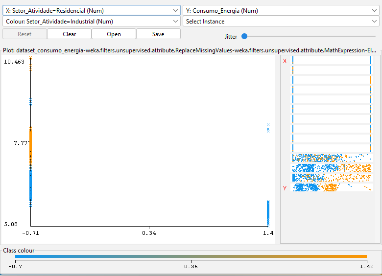

As evidências visuais reforçam que o dataset contém relações aprendíveis por modelos supervisionados, especialmente por modelos capazes de capturar relações lineares e não lineares.

---

## 5. Pré-processamento

O pré-processamento foi executado no Weka com uma sequência de filtros. A ordem dos filtros foi importante para preservar a coerência dos dados e preparar o conjunto para algoritmos sensíveis a valores ausentes, escala e atributos categóricos.

### 5.1 Tratamento de Valores Faltantes

Foi utilizado o filtro `ReplaceMissingValues`. Em atributos numéricos, o Weka substituiu os valores ausentes pela média; em atributos nominais, utilizaria a moda caso houvesse faltantes.

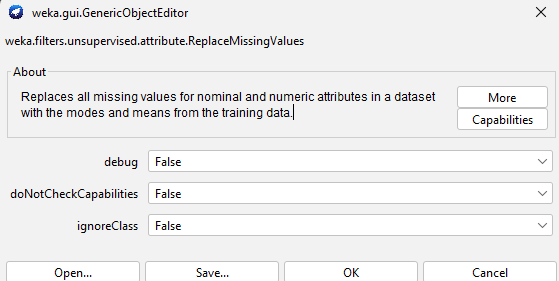

Após essa etapa, o dataset passou a não apresentar valores faltantes, preservando as 520 instâncias.

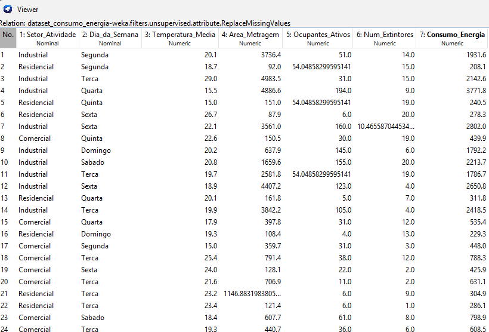

### 5.2 Transformação Logarítmica

Como `Area_Metragem` e `Consumo_Energia` apresentavam assimetria positiva, foi aplicada transformação logarítmica por meio do filtro `MathExpression`. Essa transformação reduziu o impacto dos outliers e deixou a distribuição da variável-alvo mais adequada para modelos de regressão.

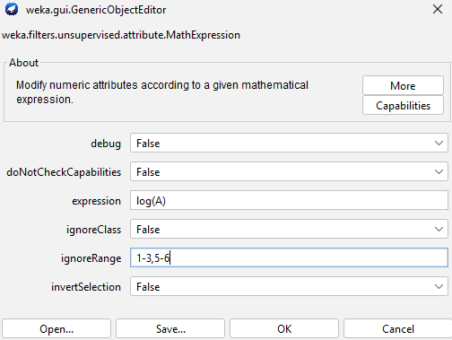

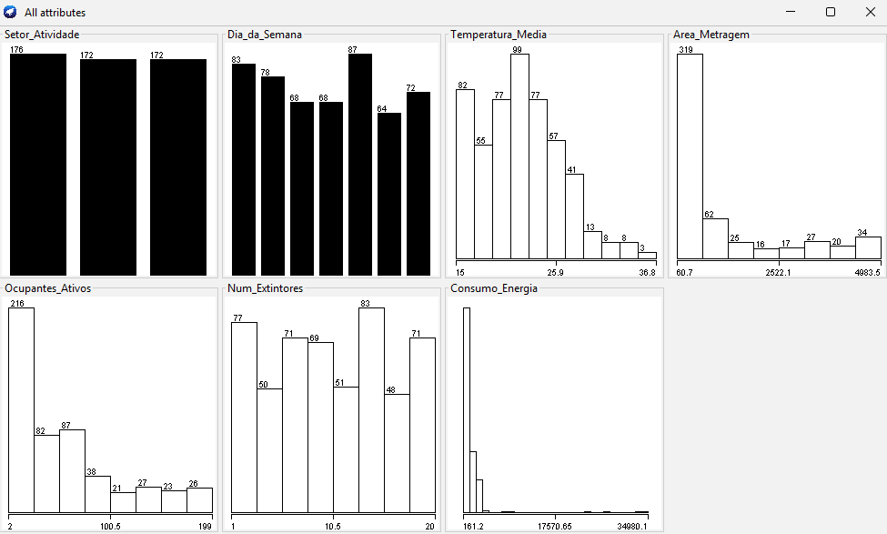

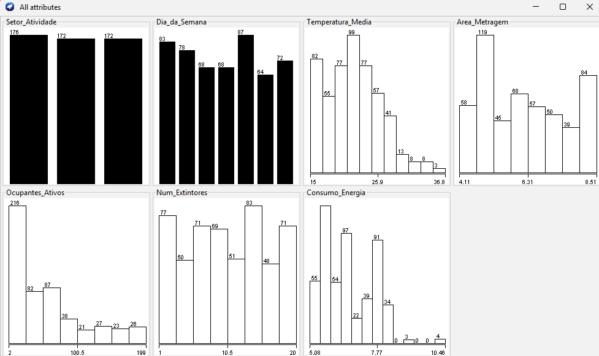

### 5.3 Remoção de Atributo Irrelevante

O atributo `Num_Extintores` foi removido por não possuir relação lógica direta com o consumo de energia elétrica. Sua permanência poderia introduzir ruído desnecessário ao treinamento.

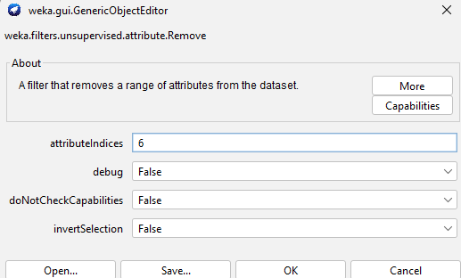

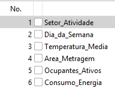

### 5.4 Conversão de Variáveis Categóricas

Os atributos `Setor_Atividade` e `Dia_da_Semana` foram convertidos por meio do filtro `NominalToBinary`, evitando que categorias nominais fossem interpretadas como valores ordinais.

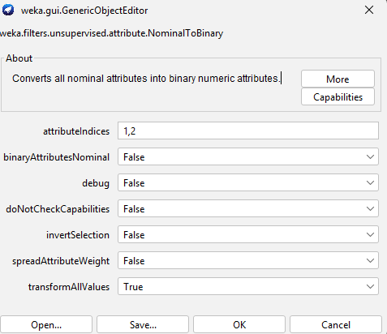

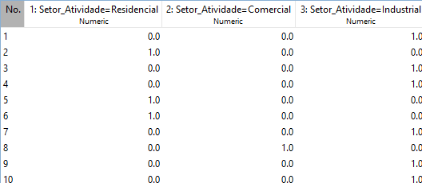

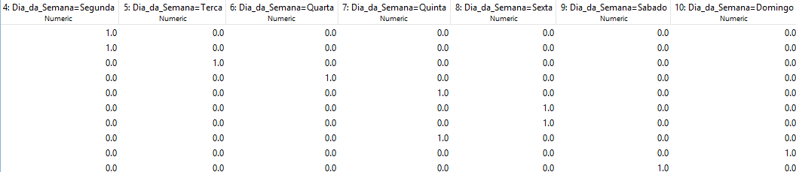

### 5.5 Padronização

Por fim, os atributos preditores foram padronizados com `Standardize`, produzindo média próxima de zero e desvio padrão unitário. O atributo `Consumo_Energia` foi definido como classe para não ser afetado pela padronização.

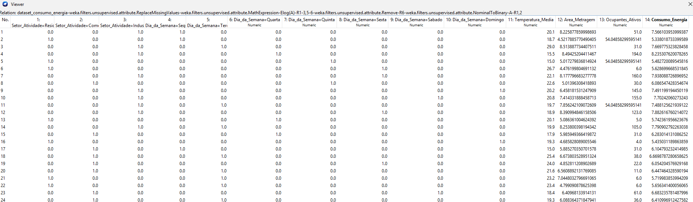

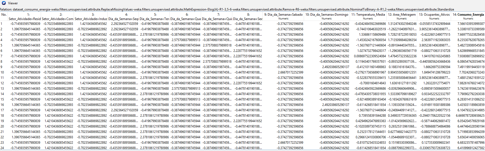

O dataset processado foi salvo para uso na etapa de modelagem.

---

## 6. Modelagem e Avaliação

A modelagem foi realizada na aba **Classify** do Weka. Como `Consumo_Energia` permaneceu numérico, os algoritmos foram executados como modelos de regressão. Portanto, métricas como acurácia, precisão, recall, F1-score e matriz de confusão não se aplicam a esta execução.

### 6.1 Estratégias de Avaliação

Duas estratégias foram utilizadas:

| Estratégia | Descrição | Finalidade |
|---|---|---|
| 10-fold cross-validation | Divide o dataset em 10 partes e alterna treino/teste | Estimar desempenho médio robusto |
| Percentage Split 70/30 | Usa 70% para treino e 30% para teste | Observar comportamento em uma divisão simples |

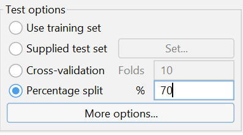

### 6.2 Algoritmos Avaliados

Os modelos avaliados foram:

| Algoritmo | Família | Papel na comparação |
|---|---|---|
| ZeroR | Regras | Baseline |
| RandomTree | Árvore | Modelo de árvore individual |
| RandomForest | Ensemble | Modelo robusto baseado em várias árvores |
| LinearRegression | Função | Modelo linear interpretável |
| IBk | Lazy/KNN | Modelo baseado em distância |
| SMOreg | SVM para regressão | Modelo baseado em margem |
| MultilayerPerceptron | Rede neural | Modelo não linear |

### 6.3 Métricas

As métricas utilizadas foram:

| Métrica | Interpretação |
|---|---|
| Correlação | Quanto maior, maior associação entre previsto e real |
| MAE | Erro médio absoluto; quanto menor, melhor |
| RMSE | Penaliza erros maiores; quanto menor, melhor |
| RAE | Erro absoluto relativo ao baseline |
| RRSE | Erro quadrático relativo ao baseline |

Como a variável-alvo passou por transformação logarítmica, os erros devem ser interpretados na escala transformada, e não diretamente na escala original em kWh.

---

## 7. Resultados

### 7.1 Validação Cruzada 10-fold

| Algoritmo | Configuração | Correlação | MAE | RMSE | RAE (%) | RRSE (%) |
|---|---|---:|---:|---:|---:|---:|
| ZeroR | Padrão | -0.0933 | 0.8359 | 0.9876 | 100.0000 | 100.0000 |
| LinearRegression | S=0, R=1.0E-8 | 0.9183 | 0.1673 | 0.3906 | 20.0170 | 39.5499 |
| SMOreg | C=1.0, PolyKernel E=1.0 | 0.9187 | 0.1512 | 0.3921 | 18.0928 | 39.7060 |
| RandomForest | 100 árvores | 0.9177 | 0.1627 | 0.3920 | 19.4630 | 39.6980 |
| RandomTree | K=0, M=1.0 | 0.8273 | 0.2534 | 0.5934 | 30.3143 | 60.0912 |
| IBk | k=1 | 0.8518 | 0.2415 | 0.5383 | 28.8840 | 54.5081 |
| IBk | k=3 | 0.8843 | 0.2315 | 0.4655 | 27.6908 | 47.1340 |
| IBk | k=5 | 0.8928 | 0.2297 | 0.4462 | 27.4790 | 45.1823 |
| MultilayerPerceptron | L=0.3, M=0.2, N=500, H=a | 0.8948 | 0.2270 | 0.4482 | 27.1507 | 45.3832 |

Na validação cruzada, os melhores modelos ficaram muito próximos. O menor RMSE foi obtido pelo LinearRegression (`0.3906`), enquanto o maior coeficiente de correlação e o menor MAE foram obtidos pelo SMOreg.

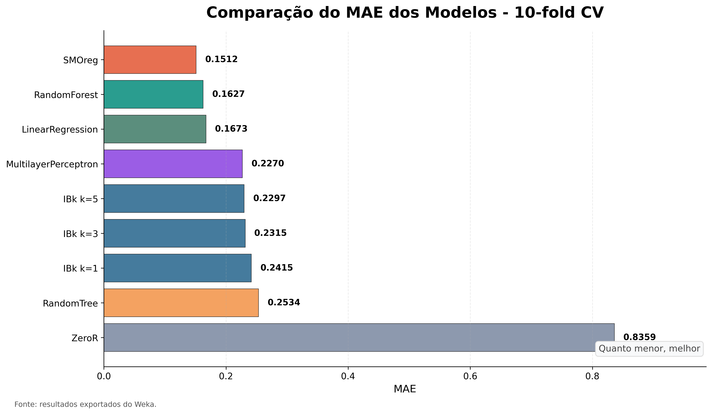

### 7.2 Percentage Split 70/30

| Algoritmo | Configuração | Correlação | MAE | RMSE | RAE (%) | RRSE (%) |
|---|---|---:|---:|---:|---:|---:|
| ZeroR | Padrão | 0.0000 | 0.8431 | 0.9618 | 100.0000 | 100.0000 |
| LinearRegression | S=0, R=1.0E-8 | 0.9204 | 0.1587 | 0.3775 | 18.8214 | 39.2560 |
| SMOreg | C=1.0, PolyKernel E=1.0 | 0.9182 | 0.1480 | 0.3831 | 17.5483 | 39.8309 |
| RandomForest | 100 árvores | 0.9208 | 0.1516 | 0.3745 | 17.9772 | 38.9433 |
| RandomTree | K=0, M=1.0 | 0.9084 | 0.2160 | 0.4092 | 25.6194 | 42.5455 |
| IBk | k=1 | 0.8702 | 0.2272 | 0.4856 | 26.9526 | 50.4957 |
| IBk | k=3 | 0.8793 | 0.2346 | 0.4607 | 27.8226 | 47.8989 |
| IBk | k=5 | 0.8951 | 0.2217 | 0.4290 | 26.2913 | 44.6074 |
| MultilayerPerceptron | L=0.3, M=0.2, N=500, H=a | 0.9067 | 0.6228 | 0.6802 | 73.8735 | 70.7219 |

No split 70/30, o RandomForest obteve o menor RMSE (`0.3745`) e a maior correlação (`0.9208`). O SMOreg manteve o menor MAE (`0.1480`), enquanto o LinearRegression continuou competitivo.

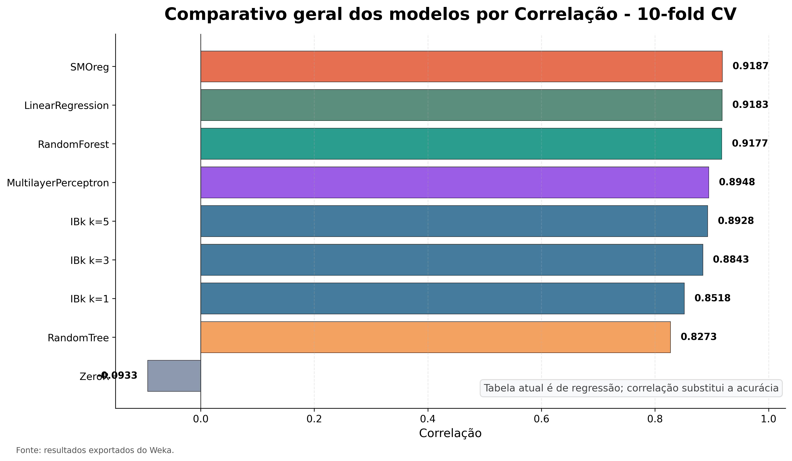

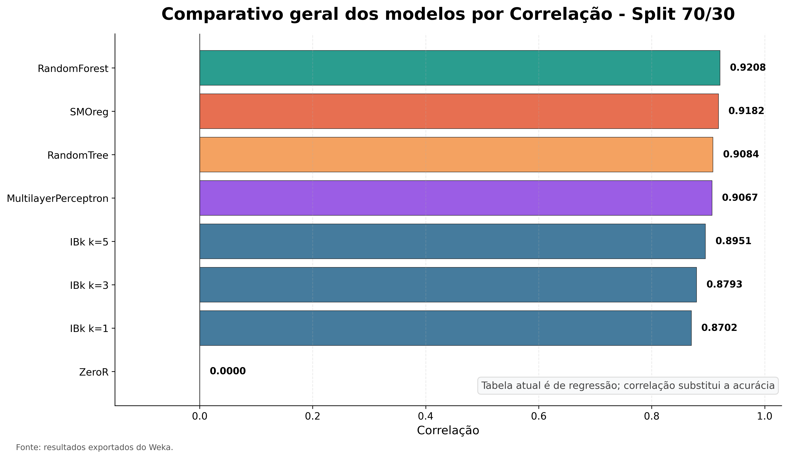

### 7.3 Comparação entre Estratégias

A comparação entre 10-fold CV e Split 70/30 mostra que os principais modelos mantiveram desempenho elevado nas duas estratégias. Essa estabilidade é especialmente importante porque reduz a chance de uma conclusão depender apenas de uma divisão específica dos dados.

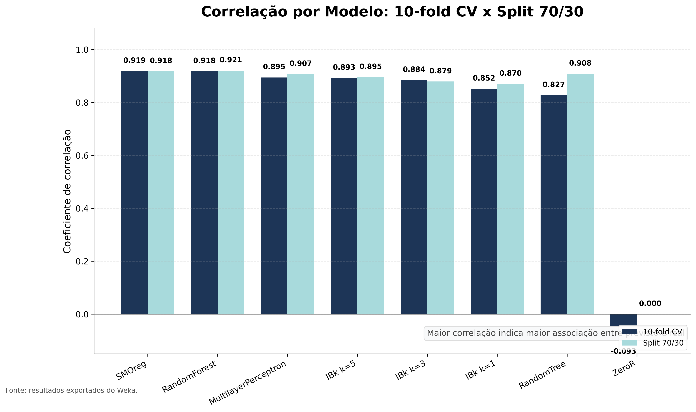

### 7.4 Ajuste de Hiperparâmetro no IBk

O IBk foi avaliado com `k=1`, `k=3` e `k=5`. O aumento de `k` reduziu o RMSE na validação cruzada, indicando que considerar mais vizinhos suavizou as predições e diminuiu a sensibilidade a ruídos locais.

| k | Correlação 10-fold | MAE 10-fold | RMSE 10-fold |
|---:|---:|---:|---:|
| 1 | 0.8518 | 0.2415 | 0.5383 |
| 3 | 0.8843 | 0.2315 | 0.4655 |
| 5 | 0.8928 | 0.2297 | 0.4462 |

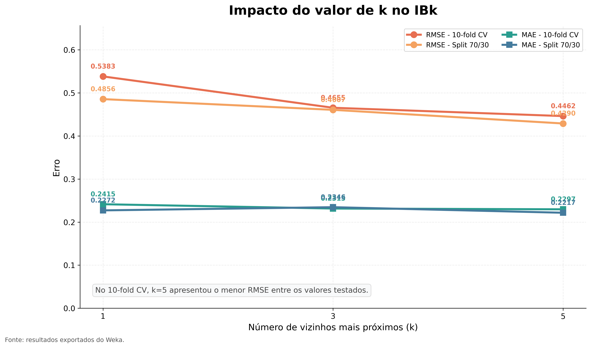

### 7.5 Mapa e Ranking de Desempenho

O mapa de desempenho e o ranking visual ajudam a sintetizar o comportamento dos modelos considerando múltiplas métricas simultaneamente. Eles reforçam que os melhores resultados se concentram em LinearRegression, SMOreg e RandomForest.

---

## 8. Discussão

O baseline ZeroR apresentou os maiores erros, como esperado, pois não aprende relações entre os atributos preditores e a variável-alvo. Seu papel foi servir como referência mínima para verificar se os demais modelos realmente capturaram padrões úteis.

O LinearRegression apresentou resultado forte, especialmente na validação cruzada, onde obteve o menor RMSE. Esse resultado é coerente com a análise visual, que mostrou relação aproximadamente linear entre área, temperatura, setor e consumo após as transformações. Como vantagem adicional, é um modelo simples e interpretável.

O SMOreg obteve o melhor coeficiente de correlação e o menor MAE na validação cruzada. Isso indica boa capacidade de produzir previsões próximas dos valores reais, especialmente em termos de erro absoluto médio. No entanto, seu RMSE foi ligeiramente superior ao LinearRegression no 10-fold CV e ao RandomForest no split 70/30.

O RandomForest apresentou o melhor equilíbrio geral. Embora não tenha vencido todas as métricas isoladamente, foi o modelo com menor RMSE no split 70/30 e manteve alta correlação nos dois cenários. Esse comportamento sugere robustez a diferentes divisões dos dados e boa capacidade de capturar interações não lineares.

O RandomTree mostrou desempenho inferior ao RandomForest, reforçando a vantagem dos ensembles sobre árvores individuais. O IBk melhorou com `k=5`, mas permaneceu abaixo dos melhores modelos. O MultilayerPerceptron foi competitivo na validação cruzada, porém teve instabilidade no Percentage Split, com MAE e RMSE elevados.

---

## 9. Escolha do Modelo Final

A seleção do modelo final considerou desempenho, estabilidade, robustez e coerência com o problema.

| Critério | Melhor modelo | Justificativa |
|---|---|---|
| Menor RMSE no 10-fold CV | LinearRegression | RMSE de `0.3906` |
| Maior correlação no 10-fold CV | SMOreg | Correlação de `0.9187` |
| Menor MAE no 10-fold CV | SMOreg | MAE de `0.1512` |
| Menor RMSE no Split 70/30 | RandomForest | RMSE de `0.3745` |
| Maior correlação no Split 70/30 | RandomForest | Correlação de `0.9208` |
| Melhor estabilidade geral | RandomForest | Desempenho alto nos dois cenários |

O modelo escolhido como melhor alternativa final foi o **RandomForest**. A decisão se justifica porque ele apresentou o menor RMSE no cenário de teste separado, manteve alta correlação e demonstrou equilíbrio entre erro baixo e estabilidade. O LinearRegression e o SMOreg também são alternativas muito fortes, mas o RandomForest oferece maior robustez por combinar várias árvores e reduzir a dependência de uma única estrutura de decisão.

---

## 10. Limitações

Apesar dos bons resultados, algumas limitações devem ser consideradas:

- O dataset é sintético, embora tenha sido construído com critérios realistas.
- O tamanho de 520 instâncias é suficiente para experimentação didática, mas ainda limitado para generalização em produção.
- A variável-alvo foi transformada por logaritmo, portanto os erros estão na escala transformada.
- A matriz de confusão não se aplica porque a tarefa foi executada como regressão.
- Os resultados podem variar se forem usados outros métodos de imputação, tratamento de outliers ou seleção de atributos.
- O MultilayerPerceptron pode exigir ajuste mais refinado de hiperparâmetros para comparação mais justa.

Para estudos futuros, recomenda-se testar dados reais, incluir variáveis temporais mais detalhadas, avaliar modelos adicionais como M5P e RandomSubSpace, e aplicar discretização da variável-alvo caso o objetivo seja comparar também modelos de classificação.

---

## 11. Conclusão

O trabalho demonstrou um fluxo completo de mineração de dados aplicado à previsão de consumo de energia elétrica: fundamentação teórica, geração de dataset, análise exploratória, pré-processamento, modelagem e avaliação comparativa.

As etapas de pré-processamento foram decisivas para a qualidade dos resultados. O tratamento de valores faltantes preservou todas as instâncias; a transformação logarítmica reduziu a assimetria da variável-alvo; a remoção do atributo irrelevante simplificou o conjunto; a conversão nominal-binária permitiu uso correto dos atributos categóricos; e a padronização favoreceu algoritmos sensíveis à escala.

Na modelagem, os resultados confirmaram que a tarefa de regressão foi adequada ao problema. LinearRegression, SMOreg e RandomForest apresentaram os melhores desempenhos. O LinearRegression evidenciou que há relações lineares fortes no dataset; o SMOreg mostrou excelente precisão média; e o RandomForest se destacou como o modelo mais equilibrado e robusto.

Assim, conclui-se que o objetivo do trabalho foi cumprido: foi possível construir e validar um processo de aprendizado supervisionado capaz de prever o consumo de energia elétrica multissetorial com desempenho consistente, documentado e interpretável.

---

## 12. Referências

BILAL, M.; KIM, H.; FAYAZ, M.; PAWAR, P. **Comparative Analysis of Time Series Forecasting Approaches for Household Electricity Consumption Prediction**. 2022. DOI: [10.48550/arXiv.2207.01019](https://doi.org/10.48550/arXiv.2207.01019).

CORDON, D.; PITA, A.; JUAN, A. A. **Classifying and Predicting Household Energy Consumption Using Data Analytics and Machine Learning**. Algorithms, v. 19, n. 2, art. 114, 2026. DOI: [10.3390/a19020114](https://doi.org/10.3390/a19020114).

DING, Z. et al. **A Comprehensive Study on Integrating Clustering with Regression for Short-Term Forecasting of Building Energy Consumption: Case Study of a Green Building**. Buildings, v. 12, n. 10, art. 1701, 2022. DOI: [10.3390/buildings12101701](https://doi.org/10.3390/buildings12101701).

LEE, M. H. L. et al. **A Comparative Study of Forecasting Electricity Consumption Using Machine Learning Models**. Mathematics, v. 10, n. 8, art. 1329, 2022. DOI: [10.3390/math10081329](https://doi.org/10.3390/math10081329).

LEÓN-MUNIZAGA, N.; AGUIRRE-MUNIZAGA, M.; LAGOS-ORTIZ, K.; DEL CIOPPO-MORSTADT, J. **Prediction of Energy Consumption in an Electric Arc Furnace Using Weka**. In: VALENCIA-GARCÍA, R. et al. (org.). CITI 2020, CCIS 1309. Cham: Springer Nature Switzerland, 2020. p. 58-70. DOI: [10.1007/978-3-030-62015-8_5](https://doi.org/10.1007/978-3-030-62015-8_5).

SARSWATULA, S. A.; PUGH, T.; PRABHU, V. **Modeling Energy Consumption Using Machine Learning**. Frontiers in Manufacturing Technology, v. 2, art. 855208, 2022. DOI: [10.3389/fmtec.2022.855208](https://doi.org/10.3389/fmtec.2022.855208).

WU, J. et al. **A Comparative Analysis of Machine Learning-Based Energy Baseline Models across Multiple Building Types**. Energies, v. 17, n. 6, art. 1285, 2024. DOI: [10.3390/en17061285](https://doi.org/10.3390/en17061285).

ZHAO, X.; HUANG, X.; DING, J.; ZHANG, Y. **A Comparative Study of Machine Learning Algorithms for Electricity Price Forecasting with LIME-Based Interpretability**. arXiv preprint, arXiv:2512.01212, 2025. DOI: [10.1109/ICEIEC65904.2025.11273147](https://doi.org/10.1109/ICEIEC65904.2025.11273147).

---

## 13. Apêndice: Evidências Visuais

Esta seção reúne prints de apoio que comprovam a execução das principais etapas no Weka e ajudam a rastrear o fluxo experimental.

### 13.1 Configuração e Resultados do RandomForest

### 13.2 Configuração e Resultados do LinearRegression

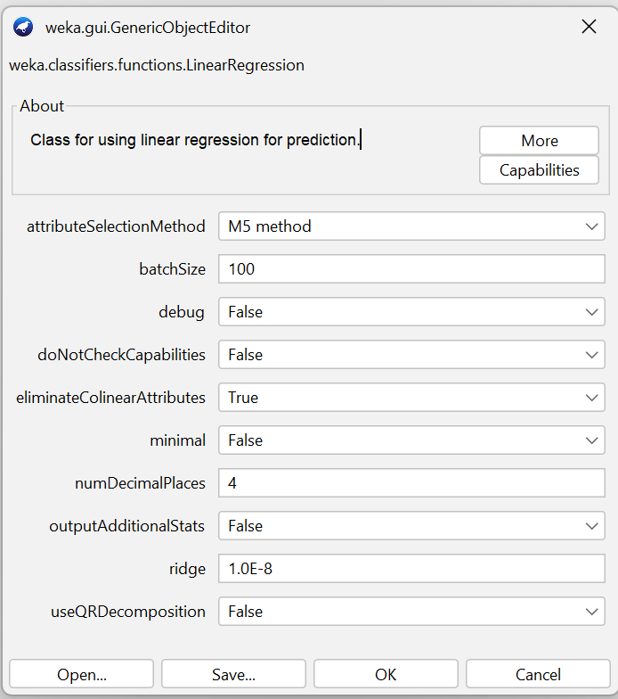

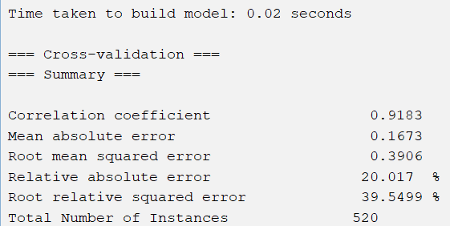

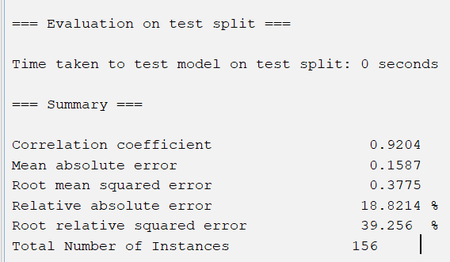

### 13.3 Configuração e Resultados do SMOreg

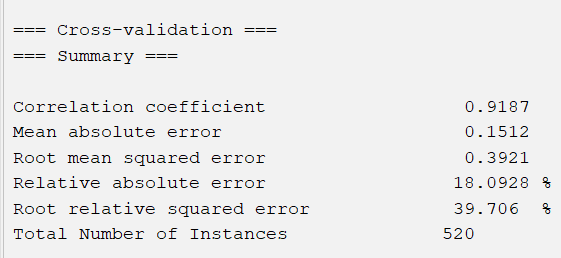

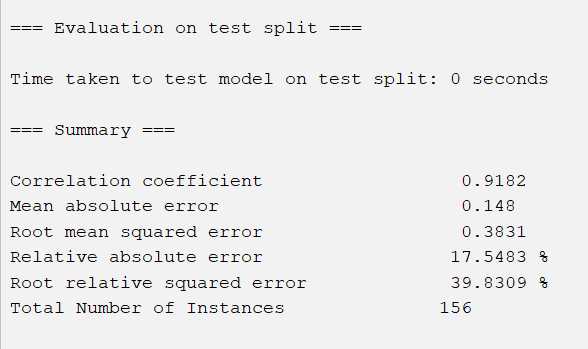

### 13.4 Evidência da Variável-Alvo Processada

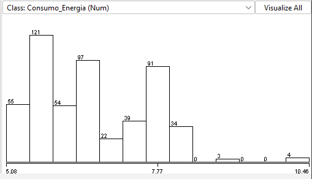

