# Treinamento e Avaliação dos Modelos no Weka

Esta etapa corresponde à execução dos algoritmos de aprendizado de máquina no software Weka, utilizando o dataset já pré-processado nas etapas anteriores. O objetivo foi treinar e testar diferentes modelos, comparar seus resultados e identificar qual algoritmo apresentou melhor desempenho para o problema de previsão do consumo de energia elétrica.

Como o pré-processamento já havia sido concluído, esta fase foi realizada diretamente na aba **Classify** do Weka, sem reaplicar filtros. O atributo alvo utilizado foi `Consumo_Energia`, definido como classe do problema.

> **Observação:** caso o atributo `Consumo_Energia` esteja em formato numérico, o Weka executará os modelos como tarefa de **regressão**. Caso ele tenha sido discretizado em faixas, como baixo, médio e alto consumo, a tarefa será tratada como **classificação**, permitindo o uso de acurácia, precisão, recall, F1-score e matriz de confusão.

---

## 1. Carregamento do Dataset Processado

Inicialmente, foi carregado no Weka o dataset resultante da etapa de pré-processamento. Esse arquivo já continha os valores faltantes tratados, os atributos categóricos convertidos para formato binário, os atributos irrelevantes removidos e os atributos numéricos padronizados.

Na aba **Preprocess**, foi aberto o arquivo processado salvo anteriormente.

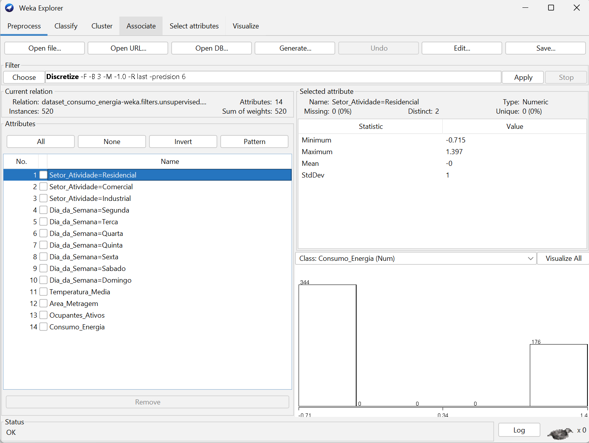

Após o carregamento, verificou-se se o atributo `Consumo_Energia` estava corretamente definido como classe. Essa verificação é importante porque o Weka utiliza o atributo selecionado como referência para o treinamento e avaliação dos algoritmos.

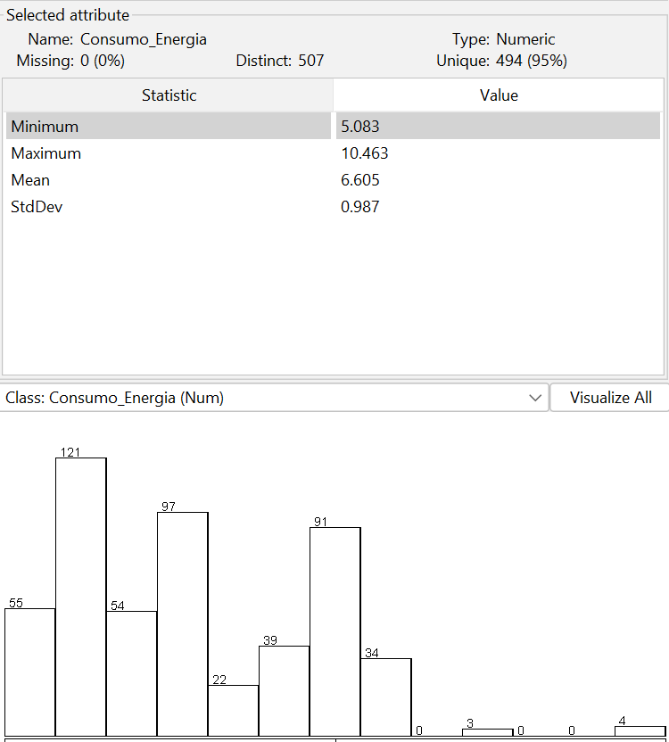

---

## 2. Estratégia de Avaliação dos Modelos

Para avaliar os algoritmos de forma mais confiável, foi utilizada a estratégia de **validação cruzada com 10 folds**. Essa abordagem divide o conjunto de dados em dez partes, utilizando nove partes para treinamento e uma parte para teste em cada repetição. Ao final, o Weka apresenta a média dos resultados obtidos nas dez execuções.

A validação cruzada foi escolhida por reduzir a dependência de uma única divisão treino/teste, permitindo uma avaliação mais estável do desempenho dos modelos.

Configuração utilizada:

```text
Test options: Cross-validation
Folds: 10
```

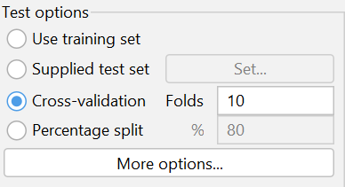

Além da validação cruzada, também foi considerada a estratégia **Percentage Split**, com divisão de 70% dos dados para treinamento e 30% para teste. Essa segunda configuração foi utilizada como cenário complementar, permitindo observar o comportamento dos algoritmos em uma divisão simples dos dados.

Configuração complementar:

```text
Test options: Percentage split
Percentage: 70%
```


---

## 3. Treinamento com o Algoritmo ZeroR

O primeiro algoritmo executado foi o **ZeroR**, utilizado como modelo de referência. Esse algoritmo não aprende relações entre os atributos de entrada e a variável alvo. Em problemas de classificação, ele prevê sempre a classe majoritária. Em problemas de regressão, ele prevê a média da variável alvo.

Por esse motivo, o ZeroR foi utilizado como baseline, permitindo verificar se os demais algoritmos realmente conseguiram aprender padrões relevantes a partir dos dados.

Caminho no Weka:

```text
Classify > Choose > rules > ZeroR
```

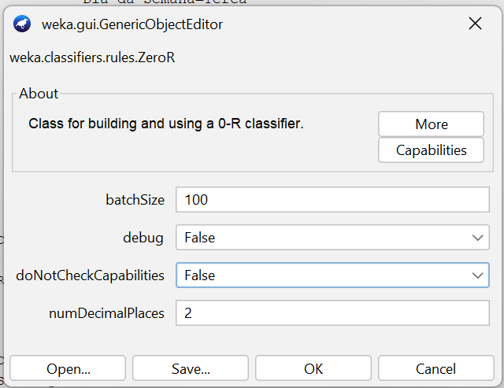

Resultado obtido com validação cruzada:


Resultado obtido com Percentage Split:

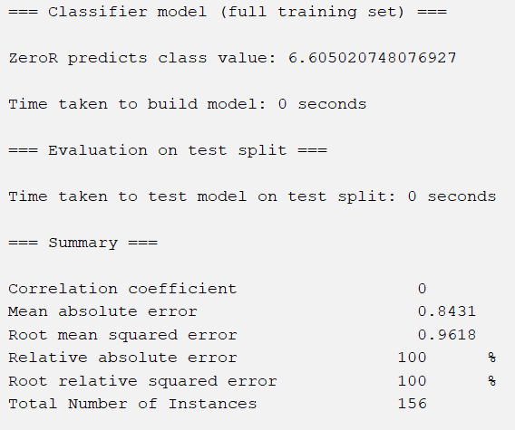

### Análise do ZeroR

O desempenho do ZeroR foi utilizado apenas como referência inicial. Como esse algoritmo ignora os atributos preditores, espera-se que modelos mais sofisticados apresentem desempenho superior. Caso algum algoritmo obtenha resultado próximo ao ZeroR, isso indica que ele teve baixa capacidade de aprendizado para este dataset.

---

## 4. Treinamento com o Algoritmo RandomTree

O **RandomTree** constrói uma árvore de decisão utilizando escolhas aleatórias de atributos durante o processo de divisão. Ele é útil para comparação com o J48 e também serve como base conceitual para o RandomForest.

Caminho no Weka:

```text
Classify > Choose > trees > RandomTree
```

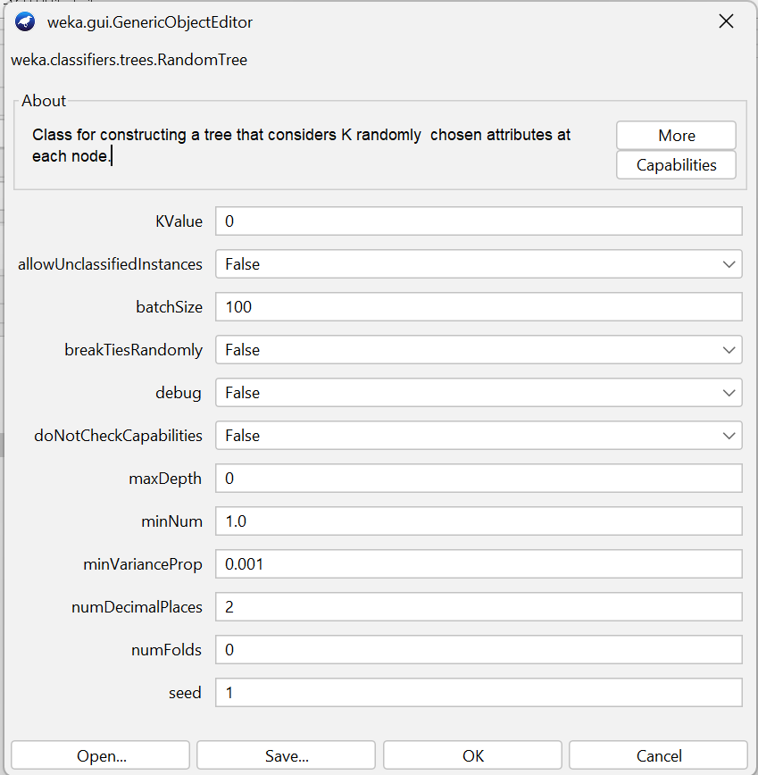

Resultado obtido com validação cruzada:

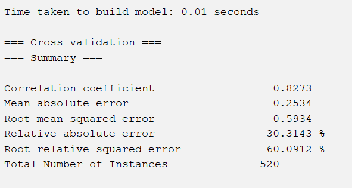

Resultado obtido com Percentage Split:

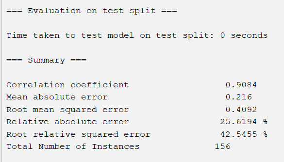

### Análise do RandomTree

O RandomTree foi avaliado para verificar o comportamento de uma árvore individual construída com aleatoriedade. Por depender de uma única árvore, esse modelo pode apresentar maior variação nos resultados quando comparado a métodos de ensemble, como o RandomForest.

---

## 5. Treinamento com o Algoritmo RandomForest

O **RandomForest** é um algoritmo de ensemble composto por várias árvores de decisão. Cada árvore é treinada com diferentes amostras e subconjuntos de atributos, e a predição final é obtida pela combinação dos resultados das árvores.

Caminho no Weka:

```text
Classify > Choose > trees > RandomForest
```

Configuração inicial utilizada:

```text
numIterations: 100
numFeatures: 0
maxDepth: 0
seed: 1
```

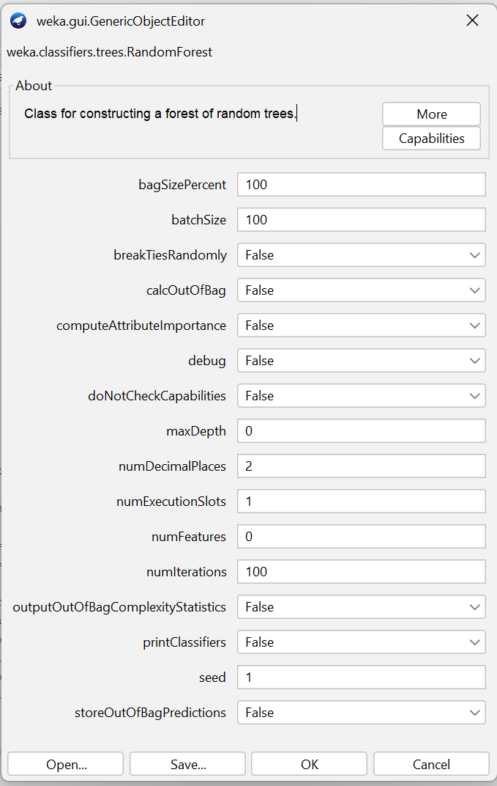

Resultado obtido com validação cruzada:

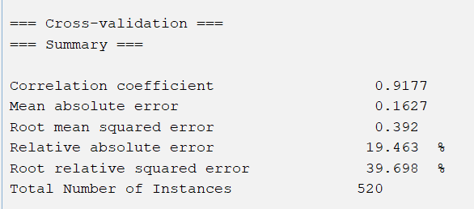

Resultado obtido com Percentage Split:

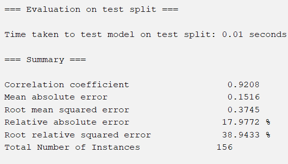

### Análise do RandomForest

O RandomForest foi utilizado por sua capacidade de reduzir a variância de árvores individuais e melhorar a generalização. Como combina múltiplas árvores, tende a apresentar desempenho mais estável do que modelos baseados em uma única árvore, especialmente quando há interações entre diferentes atributos do dataset.

---

## 6. Treinamento com o Algoritmo IBk

O **IBk** é a implementação do algoritmo K-Nearest Neighbors no Weka. Esse método classifica ou estima uma instância com base nas instâncias mais próximas no conjunto de treinamento.

Caminho no Weka:

```text
Classify > Choose > lazy > IBk
```

Configuração inicial utilizada:

```text
KNN: 1
```

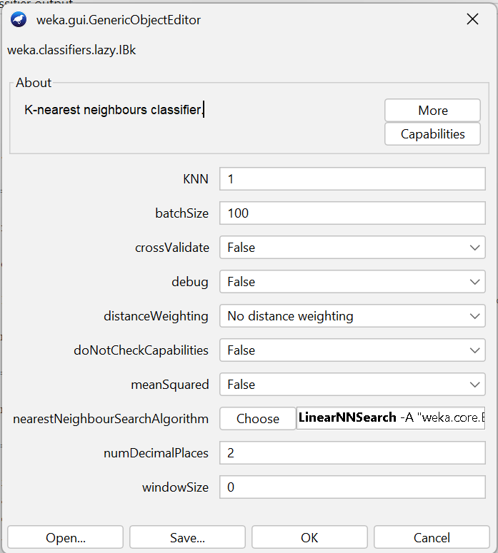

Resultado obtido com validação cruzada:

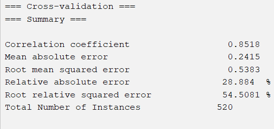

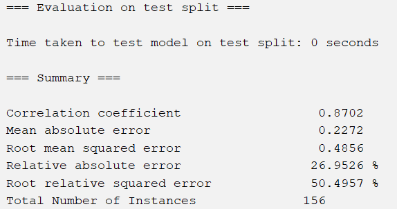

Também foram testados valores alternativos de k:

```text
KNN: 3
KNN: 5
```

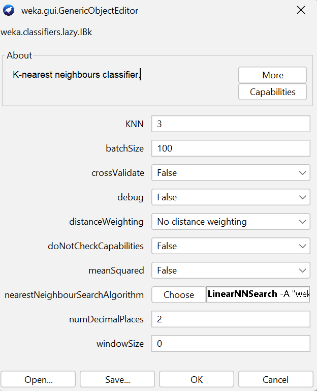

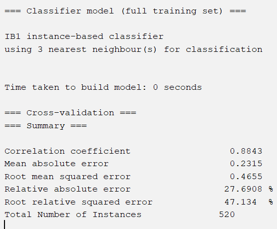

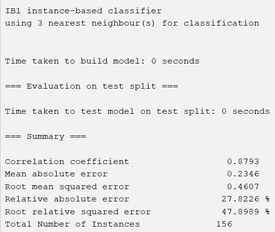

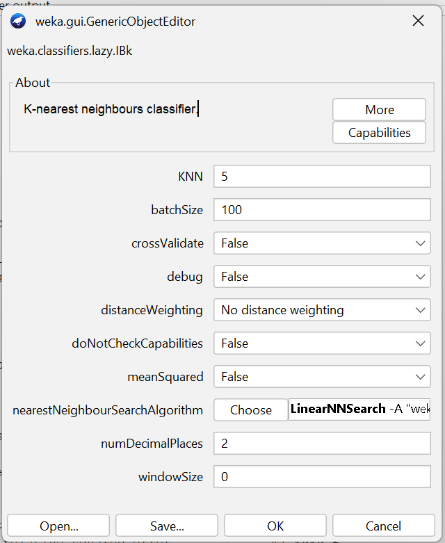

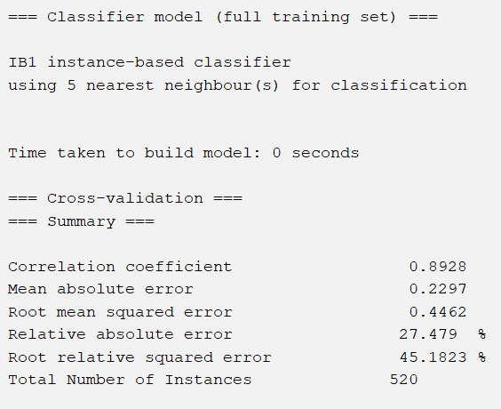

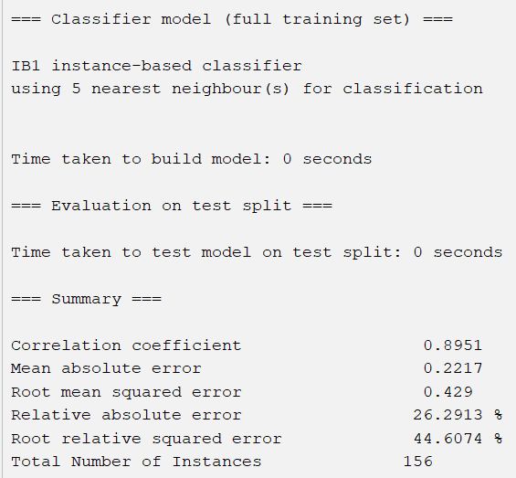

### Análise do IBk

O IBk foi avaliado porque é um algoritmo sensível à distância entre os registros. Como os dados foram padronizados anteriormente, o uso desse algoritmo se torna mais adequado, pois evita que atributos de maior escala dominem o cálculo de distância. A comparação entre diferentes valores de k permitiu verificar o impacto da quantidade de vizinhos no desempenho do modelo.

---

## 7. Treinamento com o Algoritmo SMO

O **SMO** é a implementação de máquinas de vetor de suporte no Weka para tarefas de classificação. Esse algoritmo busca encontrar uma fronteira de decisão capaz de separar as classes com a maior margem possível.

Caminho no Weka:

```text
Classify > Choose > functions > SMO
```

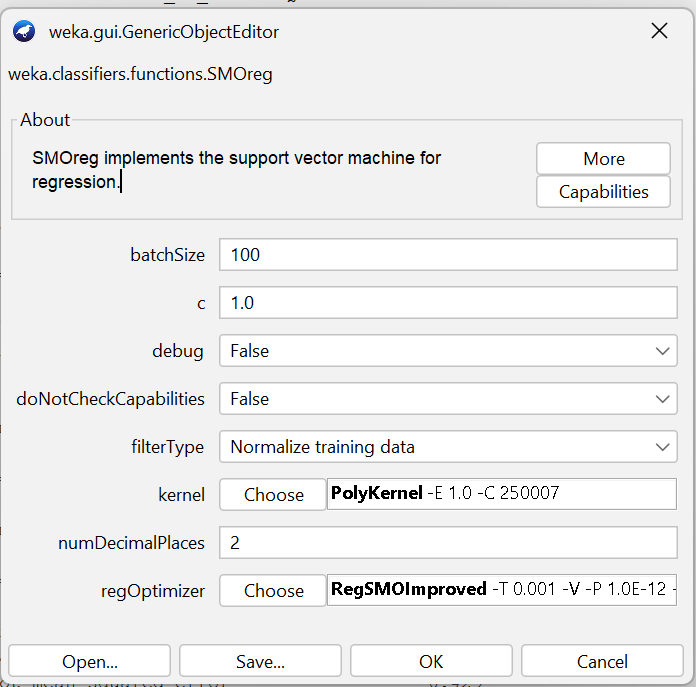

Resultado obtido com validação cruzada:


Resultado obtido com Percentage Split:


### Análise do SMO

O SMO foi avaliado por ser um modelo baseado em margem, adequado para problemas nos quais existe separação entre classes no espaço de atributos. Como o dataset passou por padronização, o uso desse algoritmo se torna mais adequado, pois modelos baseados em margem são sensíveis à escala dos atributos.

---


## 8. Treinamento com o Algoritmo Multilayer Perceptron

O **Multilayer Perceptron** é uma rede neural artificial capaz de aprender relações não lineares entre os atributos de entrada e a variável alvo. Esse modelo pode apresentar bom desempenho, mas também exige maior cuidado com tempo de treinamento e possibilidade de sobreajuste.

Caminho no Weka:

```text
Classify > Choose > functions > MultilayerPerceptron
```

Configuração inicial utilizada:

```text
learningRate: 0.3
momentum: 0.2
trainingTime: 500
hiddenLayers: a
```

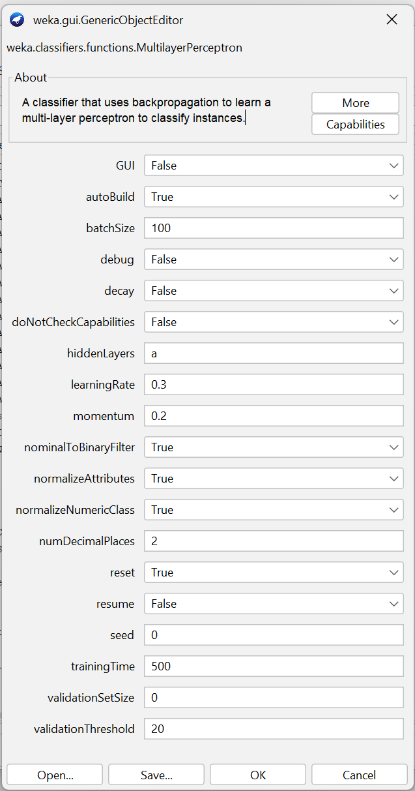

Resultado obtido com validação cruzada:

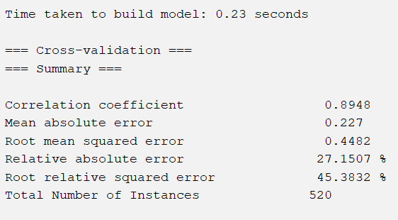

Resultado obtido com Percentage Split:

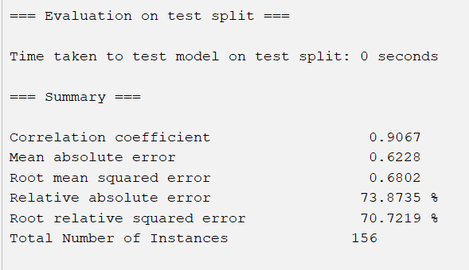

### Análise do Multilayer Perceptron

O Multilayer Perceptron foi testado para avaliar a capacidade de uma rede neural em capturar padrões complexos no dataset. Por ser mais sensível à configuração dos parâmetros e à escala dos dados, a padronização realizada anteriormente foi importante para melhorar a estabilidade do treinamento.

---

## 9. Ajuste de Hiperparâmetros

Após a execução inicial dos algoritmos, foi selecionado o **IBk** para ajuste de hiperparâmetros. A escolha ocorreu porque esse algoritmo depende diretamente do parâmetro `k`, que define a quantidade de vizinhos considerados durante a predição. Como o dataset já havia passado pela etapa de padronização, o IBk tornou-se adequado para análise, pois seu funcionamento é baseado em distância entre instâncias.

Foram testadas três configurações, variando o número de vizinhos mais próximos: `k=1`, `k=3` e `k=5`. O objetivo foi verificar se o aumento do número de vizinhos reduziria a sensibilidade do modelo a ruídos e instâncias isoladas.

| Experimento | Algoritmo | Parâmetro ajustado | Valor testado | Estratégia de avaliação | Resultado principal |
|------------|-----------|--------------------|---------------|--------------------------|--------------------|
| IBk-1 | IBk | k | 1 | 10-fold cross-validation | Correlação = 0.8518; MAE = 0.2415; RMSE = 0.5383 |
| IBk-2 | IBk | k | 3 | 10-fold cross-validation | Correlação = 0.8843; MAE = 0.2315; RMSE = 0.4655 |
| IBk-3 | IBk | k | 5 | 10-fold cross-validation | Correlação = 0.8928; MAE = 0.2297; RMSE = 0.4462 |

Print da configuração IBk com `k=1`:


Resultado do IBk com `k=1` usando validação cruzada:


Resultado do IBk com `k=1` usando Percentage Split:


Print da configuração IBk com `k=3`:


Resultado do IBk com `k=3` usando validação cruzada:


Resultado do IBk com `k=3` usando Percentage Split:


Print da configuração IBk com `k=5`:


Resultado do IBk com `k=5` usando validação cruzada:


Resultado do IBk com `k=5` usando Percentage Split:


### Análise do Ajuste de Hiperparâmetros

O ajuste do parâmetro `k` demonstrou impacto direto no desempenho do IBk. Com `k=1`, o modelo utiliza apenas o vizinho mais próximo para realizar a predição, o que pode torná-lo mais sensível a ruídos e variações locais do dataset. Essa configuração apresentou correlação de `0.8518`, MAE de `0.2415` e RMSE de `0.5383` na validação cruzada.

Ao aumentar o valor para `k=3`, houve melhora no desempenho, com correlação de `0.8843`, MAE de `0.2315` e redução do RMSE para `0.4655`. Esse resultado indica que considerar mais vizinhos contribuiu para suavizar as predições e reduzir erros maiores.

A melhor configuração entre as testadas foi obtida com `k=5`, que apresentou correlação de `0.8928`, MAE de `0.2297` e RMSE de `0.4462`. Dessa forma, observa-se que o aumento do número de vizinhos tornou o modelo mais estável, reduzindo a influência de instâncias isoladas.

---

## 10. Organização dos Resultados de Classificação

Nesta execução, o atributo alvo `Consumo_Energia` permaneceu como variável numérica. Por esse motivo, os algoritmos foram avaliados como modelos de **regressão**, e não como modelos de classificação.

Assim, métricas como **acurácia**, **precisão**, **recall**, **F1-score**, **Kappa** e **matriz de confusão** não foram geradas pelo Weka nesta etapa. Essas métricas somente seriam aplicáveis caso o atributo `Consumo_Energia` fosse discretizado em classes nominais, como `baixo`, `médio` e `alto`.

| Item | Situação nesta execução | Justificativa |
|------|--------------------------|---------------|
| Acurácia | Não aplicável | A variável alvo permaneceu numérica |
| Precisão | Não aplicável | Métrica usada em classificação |
| Recall | Não aplicável | Métrica usada em classificação |
| F1-score | Não aplicável | Métrica usada em classificação |
| Kappa | Não aplicável | Métrica usada em classificação |
| Matriz de confusão | Não aplicável | Requer classes nominais |

### Métricas consideradas

Como o problema foi executado como regressão, as métricas utilizadas foram:

* **coeficiente de correlação**;
* **MAE**;
* **RMSE**;
* **RAE**;
* **RRSE**.

Essas métricas são adequadas para avaliar a proximidade entre os valores previstos pelos modelos e os valores reais de consumo de energia.

---

## 11. Organização dos Resultados de Regressão

Como o atributo `Consumo_Energia` permaneceu numérico, os resultados foram organizados com as métricas de regressão apresentadas pelo Weka.

### 11.1 Resultados com Validação Cruzada 10-fold

| Algoritmo | Avaliação | Correlação | MAE | RMSE | RAE (%) | RRSE (%) | Observações |
|----------|-----------|------------|-----|------|---------|----------|-------------|
| ZeroR | 10-fold CV | -0.0933 | 0.8359 | 0.9876 | 100.0000 | 100.0000 | Baseline |
| RandomTree | 10-fold CV | 0.8273 | 0.2534 | 0.5934 | 30.3143 | 60.0912 | Árvore aleatória individual |
| RandomForest | 10-fold CV | 0.9177 | 0.1627 | 0.3920 | 19.4630 | 39.6980 | Ensemble com 100 árvores |
| IBk k=1 | 10-fold CV | 0.8518 | 0.2415 | 0.5383 | 28.8840 | 54.5081 | Baseado em distância |
| IBk k=3 | 10-fold CV | 0.8843 | 0.2315 | 0.4655 | 27.6908 | 47.1340 | Baseado em distância |
| IBk k=5 | 10-fold CV | 0.8928 | 0.2297 | 0.4462 | 27.4790 | 45.1823 | Melhor configuração do IBk |
| SMOreg | 10-fold CV | 0.9187 | 0.1512 | 0.3921 | 18.0928 | 39.7060 | SVM para regressão |
| MultilayerPerceptron | 10-fold CV | 0.8948 | 0.2270 | 0.4482 | 27.1507 | 45.3832 | Rede neural |

### 11.2 Resultados com Percentage Split 70/30

| Algoritmo | Avaliação | Correlação | MAE | RMSE | RAE (%) | RRSE (%) | Observações |
|----------|-----------|------------|-----|------|---------|----------|-------------|
| ZeroR | Split 70/30 | 0.0000 | 0.8431 | 0.9618 | 100.0000 | 100.0000 | Baseline |
| RandomTree | Split 70/30 | 0.9084 | 0.2160 | 0.4092 | 25.6194 | 42.5455 | Árvore aleatória individual |
| RandomForest | Split 70/30 | 0.9208 | 0.1516 | 0.3745 | 17.9772 | 38.9433 | Melhor RMSE no split |
| IBk k=1 | Split 70/30 | 0.8702 | 0.2272 | 0.4856 | 26.9526 | 50.4957 | Baseado em distância |
| IBk k=3 | Split 70/30 | 0.8793 | 0.2346 | 0.4607 | 27.8226 | 47.8989 | Baseado em distância |
| IBk k=5 | Split 70/30 | 0.8951 | 0.2217 | 0.4290 | 26.2913 | 44.6074 | Melhor configuração do IBk no split |
| SMOreg | Split 70/30 | 0.9182 | 0.1480 | 0.3831 | 17.5483 | 39.8309 | Menor MAE no split |
| MultilayerPerceptron | Split 70/30 | 0.9067 | 0.6228 | 0.6802 | 73.8735 | 70.7219 | Rede neural com erro elevado no split |

### Métricas consideradas

O **coeficiente de correlação** indica o grau de associação entre os valores reais e os valores previstos. Quanto mais próximo de `1`, melhor é a relação entre a predição e o valor real.

O **MAE** representa o erro médio absoluto, permitindo interpretar o erro médio cometido pelo modelo. Quanto menor o MAE, melhor o desempenho.

O **RMSE** penaliza erros maiores com mais intensidade, sendo útil para identificar modelos que cometem grandes desvios. Quanto menor o RMSE, melhor o modelo.

O **RAE** e o **RRSE** indicam o erro relativo em comparação com um modelo de referência. O ZeroR apresenta `100%` nessas métricas porque funciona como baseline.

---

## 12. Matriz de Confusão

Nesta etapa, a matriz de confusão **não foi gerada**, pois os experimentos foram executados como tarefa de **regressão**. A matriz de confusão é utilizada em problemas de classificação, quando a variável alvo possui classes nominais.

Como o atributo `Consumo_Energia` permaneceu numérico, o Weka apresentou métricas de regressão, como correlação, MAE, RMSE, RAE e RRSE.

Caso seja necessário utilizar matriz de confusão, será preciso discretizar o atributo `Consumo_Energia` em classes, por exemplo:

| Faixa | Classe sugerida |
|------|-----------------|
| Menor intervalo de consumo | Baixo consumo |
| Intervalo intermediário | Médio consumo |
| Maior intervalo de consumo | Alto consumo |

Após essa transformação, os algoritmos devem ser executados novamente como classificadores, e o Weka passará a apresentar acurácia, precisão, recall, F1-score, Kappa e matriz de confusão.

### Análise da Matriz de Confusão

Como a matriz de confusão não se aplica à execução atual, a interpretação dos erros foi realizada a partir das métricas de regressão. Nesse contexto, o RMSE foi utilizado para observar a ocorrência de erros maiores, enquanto o MAE permitiu avaliar o erro médio geral dos modelos.

A ausência de matriz de confusão não representa falha metodológica, mas sim consequência do tipo de problema modelado. Como o alvo permaneceu numérico, a avaliação correta deve ser feita por métricas de regressão.

---

## 13. Geração de Gráficos no Weka

Após cada execução, os resultados ficaram disponíveis na lista localizada no lado esquerdo da aba **Classify**. Para visualizar graficamente os erros do modelo, foi utilizado o seguinte procedimento:

```text
Clique com o botão direito no resultado do algoritmo
Visualize classifier errors
```

Para os experimentos de regressão, a visualização dos erros permite observar a distância entre os valores previstos e os valores reais. Quanto mais próximos os pontos estiverem da tendência esperada, melhor é o comportamento do modelo.

Como os prints de configuração e resultados já foram inseridos nas seções anteriores com os nomes reais dos arquivos (`image-4.png`, `image-6.png`, `image-10.png`, `image-11.png`, `image-15.png`, `image-16.png`, `image-18.png`, `image-19.png`, `image-20.png`, `image-22.png`, `image-24.png`, `image-25.png`, `image-27.png`, `image-28.png`, `image-29.png` e `image-31.png`), esta seção fica destinada apenas à explicação do procedimento de visualização dos erros.

---

## 14. Gráficos Utilizados na Apresentação

Para a apresentação, foram selecionados gráficos objetivos, priorizando a comparação visual entre os modelos de regressão. Como os resultados desta etapa são de regressão, os gráficos mais adequados são de **correlação**, **MAE** e **RMSE**, em vez de gráficos de acurácia ou F1-score.

### 14.1 Comparação da Correlação dos Modelos

Esse gráfico deve apresentar o coeficiente de correlação obtido por cada algoritmo na validação cruzada com 10 folds. Ele permite identificar quais modelos apresentaram maior associação entre os valores previstos e os valores reais.

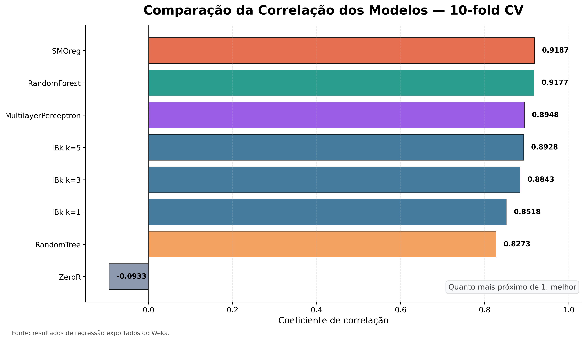

### 14.2 Comparação do RMSE dos Modelos

O RMSE deve ser utilizado para comparar os modelos considerando a penalização de erros maiores. Modelos com menor RMSE são preferíveis, pois apresentam menor desvio médio quadrático em relação aos valores reais.

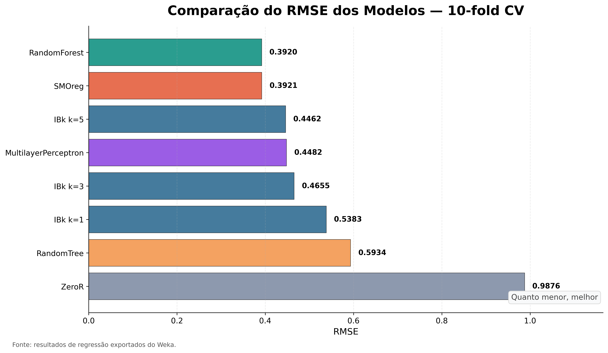

### 14.3 Comparação do MAE dos Modelos

O MAE deve ser utilizado para complementar a análise do RMSE, pois representa o erro médio absoluto de forma mais direta. Quanto menor o MAE, mais próximas são as previsões do modelo em relação aos valores reais.

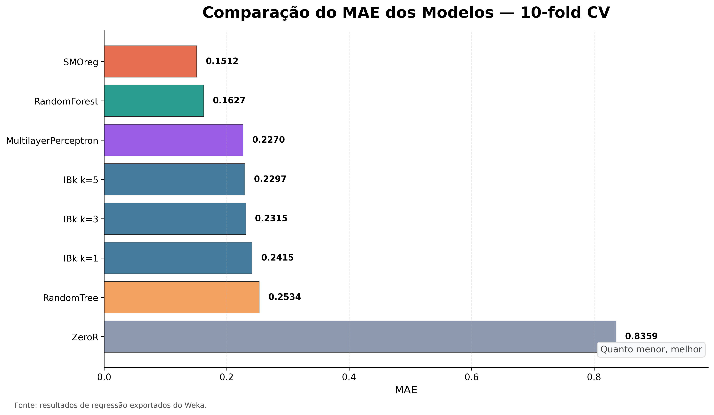

### 14.4 Impacto do Ajuste de Hiperparâmetros

Esse gráfico deve apresentar o impacto da variação do parâmetro `k` no desempenho do IBk. Observa-se que o aumento de `k=1` para `k=5` reduziu o RMSE, indicando melhora na estabilidade das predições.

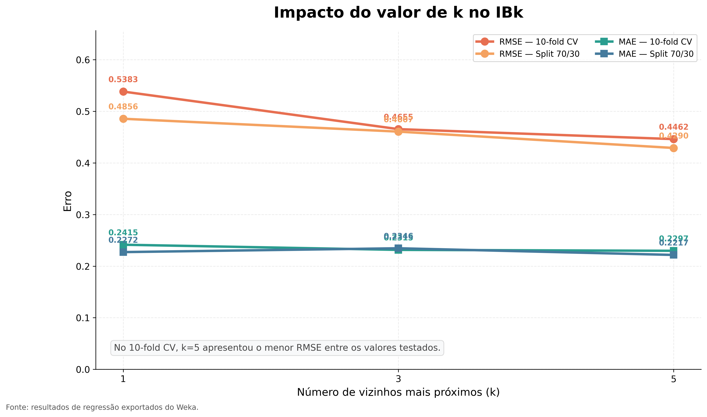
---

## 15. Discussão Comparativa dos Resultados

A comparação entre os algoritmos permitiu observar diferenças importantes de desempenho. O **ZeroR** serviu como modelo de referência, apresentando os maiores erros e correlação próxima de zero ou negativa. Esse comportamento era esperado, pois o ZeroR apenas prevê um valor médio, sem aprender relações entre os atributos.

O **RandomTree** apresentou desempenho superior ao baseline, mas inferior ao RandomForest. Isso indica que uma única árvore consegue capturar parte da estrutura dos dados, porém é mais sensível à variação das instâncias e pode apresentar maior instabilidade.

O **RandomForest** apresentou comportamento robusto nos dois cenários de avaliação. Na validação cruzada, obteve correlação de `0.9177` e RMSE de `0.3920`. No percentage split 70/30, apresentou correlação de `0.9208` e RMSE de `0.3745`, sendo o modelo com menor RMSE nesse cenário. Esse desempenho pode ser explicado pela combinação de múltiplas árvores, o que reduz a dependência de uma única estrutura de decisão.

O **SMOreg** apresentou o melhor desempenho na validação cruzada quando considerado o coeficiente de correlação, alcançando `0.9187`, além do menor MAE, com `0.1512`. Isso mostra que o modelo baseado em margem conseguiu realizar previsões próximas dos valores reais, sendo uma alternativa muito competitiva ao RandomForest.

O **IBk** demonstrou melhora progressiva conforme o valor de `k` aumentou. O modelo com `k=5` foi melhor que as configurações com `k=1` e `k=3`, indicando que considerar mais vizinhos reduziu a sensibilidade a ruídos locais.

O **MultilayerPerceptron** apresentou desempenho razoável na validação cruzada, com correlação de `0.8948` e RMSE de `0.4482`. Entretanto, no percentage split 70/30, apesar da correlação de `0.9067`, o modelo apresentou MAE de `0.6228` e RMSE de `0.6802`, indicando instabilidade e maior erro nesse cenário.

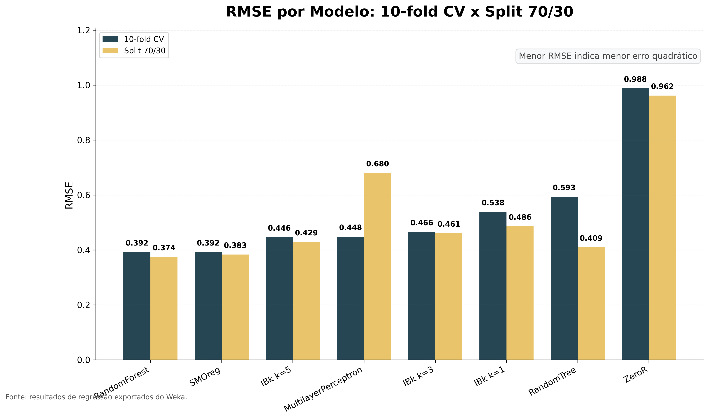

---

## 16. Escolha do Melhor Modelo

Após a comparação dos resultados, o melhor modelo foi definido considerando não apenas o maior valor de correlação, mas também o menor erro, a estabilidade entre os cenários avaliados e o comportamento geral das métricas.

| Critério | Modelo escolhido | Justificativa |
|---------|------------------|---------------|
| Melhor desempenho geral | RandomForest | Apresentou alto coeficiente de correlação e menor RMSE no cenário de split 70/30 |
| Menor erro absoluto médio | SMOreg | Obteve o menor MAE tanto na validação cruzada quanto no split 70/30 |
| Menor erro quadrático | RandomForest | Apresentou o menor RMSE entre os modelos avaliados no split 70/30 |
| Melhor estabilidade | RandomForest | Manteve desempenho consistente nos dois cenários de avaliação |
| Melhor equilíbrio entre desempenho e robustez | RandomForest | Combinou boa correlação, baixo erro e maior robustez por ser um ensemble |

> O modelo selecionado como melhor alternativa foi o **RandomForest**, pois apresentou melhor equilíbrio entre desempenho, estabilidade e capacidade de generalização. Embora o **SMOreg** tenha obtido a maior correlação e o menor MAE na validação cruzada, o RandomForest apresentou o menor RMSE no cenário de split 70/30 e manteve resultados consistentes nos dois cenários avaliados. Assim, considerando o conjunto das métricas, o RandomForest demonstrou comportamento mais robusto para a previsão do consumo de energia.

---

## 17. Limitações Observadas

Apesar dos bons resultados obtidos, algumas limitações devem ser consideradas. A primeira limitação está relacionada ao tamanho do dataset, composto por 520 instâncias. Embora esse volume permita a execução de diferentes algoritmos no Weka, ainda pode limitar a generalização dos modelos para cenários mais amplos.

Outra limitação está relacionada à execução do problema como regressão. Como o atributo `Consumo_Energia` permaneceu numérico, não foi possível gerar matriz de confusão nem métricas de classificação. Caso o objetivo seja analisar classes de consumo, será necessário discretizar a variável alvo em faixas como baixo, médio e alto consumo.

Também é importante destacar que os valores de consumo passaram por transformação logarítmica. Portanto, a interpretação dos erros deve considerar que os resultados estão na escala transformada, e não diretamente na escala original do consumo energético.

Além disso, alguns modelos demonstraram maior sensibilidade à estratégia de avaliação. O MultilayerPerceptron, por exemplo, apresentou erro elevado no cenário de split 70/30, indicando que redes neurais podem exigir ajuste mais cuidadoso de hiperparâmetros, como taxa de aprendizado, momentum, número de épocas e arquitetura da camada oculta.

Por fim, os resultados dependem das escolhas realizadas durante o pré-processamento, como imputação de valores faltantes, transformação logarítmica, remoção de atributos, conversão de variáveis categóricas e padronização. Essas decisões influenciam diretamente o comportamento dos algoritmos durante o treinamento.

---

## 18. Conclusão da Etapa de Modelagem

A etapa de modelagem permitiu comparar diferentes algoritmos de aprendizado de máquina no Weka, avaliando seus desempenhos sobre o dataset de consumo de energia elétrica. A utilização da validação cruzada com 10 folds contribuiu para uma avaliação mais robusta, enquanto o percentage split 70/30 permitiu observar o comportamento dos modelos em uma divisão simples de treino e teste.

A comparação entre os algoritmos evidenciou que modelos simples, como o ZeroR, são úteis como referência inicial, mas possuem capacidade preditiva limitada. Modelos mais robustos, como RandomForest e SMOreg, apresentaram os melhores desempenhos, com altos coeficientes de correlação e baixos valores de erro.

O RandomForest destacou-se pelo equilíbrio entre desempenho e estabilidade, apresentando bons resultados tanto na validação cruzada quanto no split 70/30. O SMOreg também demonstrou excelente desempenho, especialmente pelo menor erro absoluto médio. Já o IBk mostrou melhora com o ajuste do parâmetro `k`, sendo a configuração com `k=5` a mais adequada entre as testadas.

Por fim, a análise das métricas permitiu interpretar criticamente os resultados, indo além da simples apresentação de valores numéricos. Como a tarefa foi executada como regressão, as métricas corretas foram correlação, MAE, RMSE, RAE e RRSE. Caso seja necessário incluir matriz de confusão e métricas de classificação, recomenda-se realizar uma nova execução com o atributo `Consumo_Energia` discretizado em classes.
